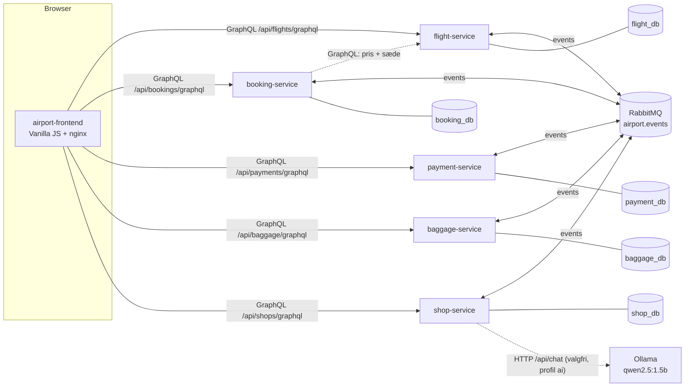
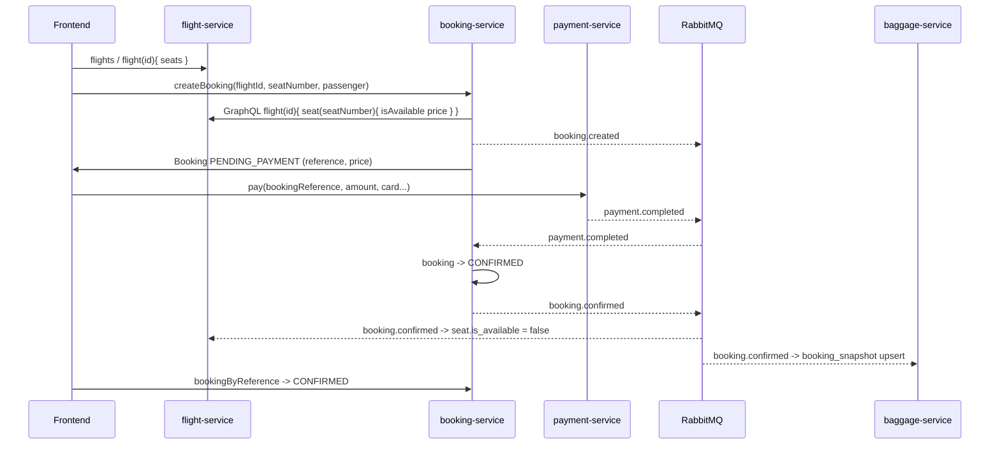
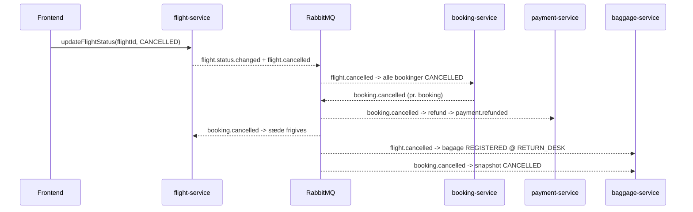
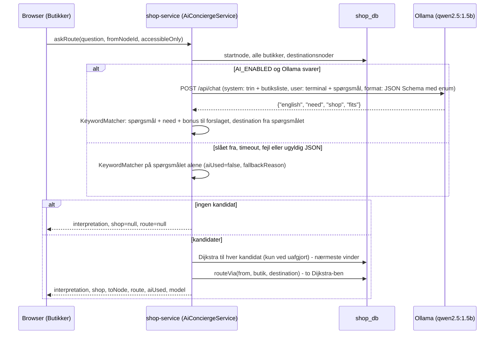
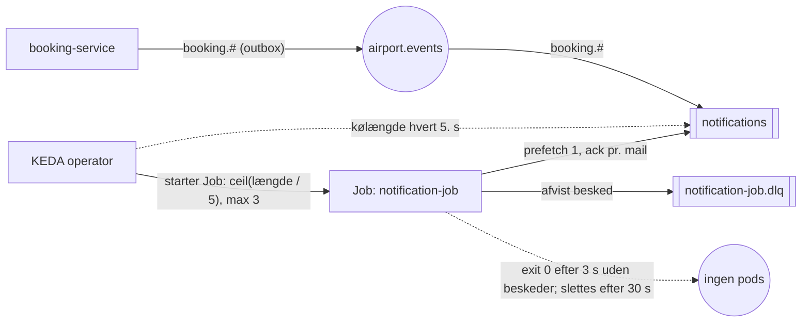
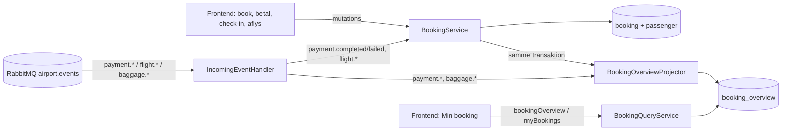
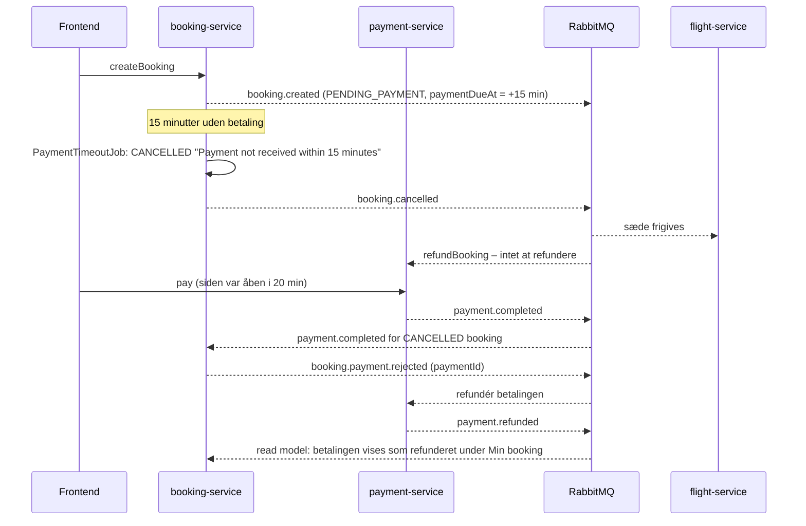

# Arkitektur

## Overblik



```
  [Frontend]  --GraphQL-->  [Flight Service]   ---> flight_db
              --GraphQL-->  [Booking Service]  ---> booking_db   --GraphQL--> Flight Service (pris/sæde)
              --GraphQL-->  [Payment Service]  ---> payment_db
              --GraphQL-->  [Baggage Service]  ---> baggage_db
              --GraphQL-->  [Shop Service]     ---> shop_db

  Alle backend-services <--events--> [RabbitMQ: topic exchange "airport.events"]
```

Regler der overholdes:

* Én PostgreSQL-database pr. service. Ingen service læser i en anden services database.
* Synkront: frontend → service via GraphQL over HTTP (Spring for GraphQL) med Keycloak-JWT som Bearer-token på
  beskyttede operationer (se *Sikkerhed*). `baggage-service` udstiller derudover et versioneret REST-API
  (`/api/baggage/v1`) oven på den samme service-klasse (se *API-versionering*); øvrige REST-endpoints er
  actuator (`/actuator/health`, `/actuator/info`, `/actuator/metrics`) og OpenAPI/Swagger UI.
* Asynkront: service → service via events på RabbitMQ (se [events.md](events.md)).
* Services cacher snapshots fra events (fx booking gemmer flightnummer, afgangstid, gate og flystatus;
  baggage gemmer `booking_snapshot`). Kilden til sandhed er altid den ejende service.
* Frontend kalder services direkte. I docker-compose via `localhost:808x` med CORS; i Kubernetes via
  én Ingress, hvor frontend og API deler origin.

## Teknologi pr. service

Alle fem backend-services er bygget over samme skabelon (flight-service var den første og de øvrige er
kopier af strukturen):

| Lag         | Pakke        | Indhold                                                                 |
|-------------|--------------|-------------------------------------------------------------------------|
| domain      | `.domain`    | JPA-entiteter, enums, `ApiException` + `ErrorCode`                      |
| repository  | `.repository`| Spring Data JPA repositories (+ Specifications hvor der filtreres)      |
| service     | `.service`   | Forretningslogik, transaktioner, ren domænelogik (pris, regler, Dijkstra) |
| graphql     | `.graphql`   | `@Controller` med `@QueryMapping`/`@MutationMapping`/`@SchemaMapping`, input-records med Bean Validation, `GraphQlExceptionResolver` |
| messaging   | `.messaging` | `EventEnvelope`, `EventPublisher` + `OutboxEvent`/`OutboxRelay` (transactional outbox), consumers + transaktionelle handlers, `ProcessedEvent` (idempotens) |
| query       | `.query`     | Kun booking-service: read-modellen `booking_overview` (entity, projektor, `BookingQueryService`) – se *CQRS* |
| config      | `.config`    | RabbitMQ-topologi (exchange, køer, DLQ), GraphQL-scalars                |

Skema og seed-data styres af Flyway (`V1__init.sql`, `V2__seed.sql`, `V{n}__outbox.sql`); Hibernate kører med
`ddl-auto=validate`.

### GraphQL-fejl

Alle fejl returneres i `errors[].extensions.code` med en af koderne
`NOT_FOUND`, `VALIDATION_ERROR`, `INVALID_STATE`, `SEAT_TAKEN`, `UPSTREAM_UNAVAILABLE`, `ALREADY_PAID`,
`BAGGAGE_LIMIT_EXCEEDED`, `ROUTE_NOT_FOUND`, `CONFLICT`, `INTERNAL_ERROR`, `PAYMENT_FAILED`,
`UNAUTHORIZED` (operationen kræver login, men der var intet gyldigt Bearer-token) og `FORBIDDEN` (logget ind, men
rollen tillader ikke operationen – fx `PASSENGER` der kalder `updateFlightStatus`). Et token, der er udløbet eller
har forkert `iss`, afvises med HTTP 401 allerede inden GraphQL.
`PAYMENT_FAILED` er defineret, men kastes ikke: `pay` returnerer et `Payment` med `status: FAILED` og `failureReason`
i stedet for en GraphQL-fejl (se designvalg nedenfor).
Bean Validation-fejl (`ConstraintViolationException`) mappes til `VALIDATION_ERROR` med feltnavne i beskeden.

### Messaging

* Én topic exchange `airport.events`, routing key = eventnavn.
* Én durable kø pr. service pr. interesse (`<service>.<interesse>-events`), bundet med `<prefix>.#`.
* Retry: Spring AMQP stateless retry, 3 forsøg med eksponentiel backoff; derefter reject → dead-letter
  exchange `airport.events.dlx` → `<service>.dlq`.
* Idempotens: `processed_event(event_id)` skrives i samme transaktion som tilstandsændringen.
* Publicering går gennem en **transactional outbox**: `EventPublisher.publish` rører ikke RabbitMQ, men
  serialiserer envelopen og indsætter den i tabellen `outbox_event` i samme transaktion som
  tilstandsændringen. Tilstand og event committes derfor atomisk (eller rulles tilbage sammen), og
  `publish` fejler hårdt hvis den kaldes uden for en transaktion.
* `OutboxRelay` (`@Scheduled`, hvert 500 ms) sender rækkerne videre: den tager en Postgres advisory lock
  (`pg_try_advisory_xact_lock`), så kun ét relay er aktivt pr. service selv med flere replicas, læser de ældste
  usendte rækker (`ORDER BY id ... FOR UPDATE`), sender batchen med publisher confirms
  (`RabbitTemplate.invoke` + `waitForConfirmsOrDie`) og sætter først `published_at` når brokeren har
  bekræftet. Fejler sendingen (broker nede, nack, timeout) tælles `attempts` op, `last_error` gemmes, og
  rækkerne bliver liggende til næste poll. Backloggen ses som gauge `outbox.pending` (`/actuator/metrics`).
* Garanti: at-least-once fra producent + idempotent consumer (`processed_event`) = effektivt exactly-once.
  Dør relayet mellem bekræftelse og commit, sendes rækken igen med samme `eventId`, og modtageren
  ignorerer duplikatet. Rækkefølgen pr. producent bevares (ét aktivt relay, `ORDER BY id`, en fejlet batch
  gentages som helhed).
* Consumeren parser selv envelope-JSON (ingen `__TypeId__`-magi), så services kan have hver sin kopi af
  `EventEnvelope` uden delt bibliotek.

## API-versionering

Systemet har tre slags API'er, og de har hver sin klient og dermed hver sin måde at udvikle sig på. Fælles regel:
**en ændring, der kan brække en eksisterende klient, må aldrig ske i den eksisterende kontrakt.**

| API-type | Hvor | Versionering | Hvem påvirkes |
|----------|------|--------------|----------------|
| REST | `baggage-service` `/api/baggage/v1` | Version i stien; `v2` udstilles ved siden af `v1` | Eksterne HTTP-klienter, der ikke kan opdateres samtidig |
| GraphQL | alle fem services, `/api/<x>/graphql` | Ingen version i URL'en; felter udfases med `@deprecated` | Frontenden, der deployes sammen med backenden |
| Events | RabbitMQ `airport.events` | Nyt eventnavn med suffiks, fx `baggage.registered.v2` | Alle consumers, som deployes uafhængigt |

### REST: version i stien

`/api/baggage/v1/...`. Et brud – et felt fjernes, betydningen af et felt ændres, en ny påkrævet parameter
tilføjes, en statuskode ændres – bliver til `/api/baggage/v2` **ved siden af** v1. Begge versioner kører i samme
service og over den samme `BaggageService`, så forretningsreglerne kun findes ét sted; det er kun DTO'erne og
controlleren, der dubleres. v1 fjernes først, når ingen klienter bruger den (kan aflæses på adgangsloggen).
Bagudkompatible tilføjelser – et nyt valgfrit felt i svaret, en ny endpoint – sker i v1, fordi en klient, der
ignorerer ukendte felter, ikke brækker af dem.

Alternativerne (`Accept: application/vnd.airport.v2+json`, `?version=2`, header `X-API-Version`) blev fravalgt:
sti-versionering er synlig i browseren, i logs, i Ingress-regler og i curl-eksempler, og den kræver ikke, at
klienten kan sætte custom headers. Prisen er, at URL'en ikke længere peger på "ressourcen" i ren REST-forstand.

### GraphQL: `@deprecated` i stedet for versioner

GraphQL-klienten vælger selv sine felter, så et nyt felt kan ikke brække nogen: additive ændringer er gratis.
Et felt, der skal væk, markeres i skemaet og lever videre, indtil frontenden ikke spørger efter det mere:

```graphql
type Baggage {
  lastLocation: String
  location: String @deprecated(reason: "Omdøbt til lastLocation i september 2026. Fjernes når frontenden er flyttet.")
}
```

Det er muligt her, fordi frontenden er den eneste GraphQL-klient og deployes sammen med backenden. Skulle en
tredjepart komme til, ville samme model som REST (`/api/<x>/graphql/v2`) være næste skridt.

### Events: suffiks på eventtypen

Envelopen (`eventId`, `eventType`, `occurredAt`, `producer`, `payload`) er stabil; det er `payload`, der udvikler
sig. Et nyt valgfrit felt i payloaden er bagudkompatibelt, fordi consumerne læser felt for felt
(`payload.path("x")`) og ikke fejler på ukendte felter. Et brud får et nyt eventnavn med suffiks, fx
`baggage.registered.v2`, som publiceres **ved siden af** `baggage.registered` i en overgangsperiode. Fordi
køerne binder på `<prefix>.#` (fx `baggage.#`), modtager eksisterende consumers automatisk begge, og de kan
ignorere det nye navn, indtil de er flyttet – derefter stopper producenten det gamle event. Alternativet (et
`version`-felt i envelopen) blev fravalgt, fordi routing key'en så ikke kan bruges til at filtrere.

Eventkontrakterne er dokumenteret i [events.md](events.md), REST-kontrakten i
`docs/openapi/baggage-v1.yaml` (genereret fra koden af springdoc).

## Flows

### Flow A – Booking og betaling



1. Frontend henter afgange og sæder fra flight-service.
2. `createBooking` → booking-service validerer sædet og henter prisen synkront hos flight-service,
   gemmer booking i `PENDING_PAYMENT` og publicerer `booking.created`.
   Dobbeltbooking forhindres af et partielt unikt indeks på `(flight_id, seat_number) WHERE status <> 'CANCELLED'`
   → fejlkode `SEAT_TAKEN`.
3. `pay(...)` → payment-service simulerer gateway og publicerer `payment.completed` (eller `payment.failed`).
4. booking-service modtager `payment.completed` → `CONFIRMED` → publicerer `booking.confirmed`
   (`payment.failed` → `CANCELLED` → `booking.cancelled`).
5. flight-service markerer sædet optaget. 6. baggage-service opretter `booking_snapshot`.
7. Frontend poller `bookingByReference` og viser `CONFIRMED`.

### Flow B – Bagage

1. `registerBaggage(reference, 23, CHECKED)` → baggage-service tjekker `booking_snapshot.status ∈ {CONFIRMED, CHECKED_IN}`,
   max 3 CHECKED pr. booking og max 32 kg → tag `BAG-XXXXXXXX`, event `baggage.registered`.
2. `updateBaggageStatus(tag, LOADED, "Belt 4")` → event `baggage.status.changed`.
3. Frontend viser bagage under "Min booking" – via booking-services read model `bookingOverview`, som får
   `baggage.registered`/`baggage.status.changed` på køen `booking-service.baggage-events` (se *CQRS*).

### Flow C – Aflysning



### Flow D – Navigation

1. Frontend vælger fra-node ("Security T2") og til-node ("Gate B12") blandt `navNodes`.
2. `route(fromNodeId, toNodeId, accessibleOnly)` → Dijkstra over `nav_edge` (kanterne behandles som
   tovejs; `accessibleOnly=true` udelader kanter med `accessible=false`, fx trapper).
3. Svaret indeholder trin-for-trin instruktioner, samlet afstand, estimeret gangtid (80 m/min) og
   `shopsAlongRoute` – butikker hvis node indgår i ruten. Frontend tegner gangnetværket og ruten på et SVG-kort med
   nummererede trin, instruktionstekst pr. trin, afstand pr. delstrækning og retningspile; trin på en anden etage vises som hint.

### Flow E – Spørg om vej (AI)

1. Frontend (*Butikker*) sender fritekst + "Hvor er jeg?" til `askRoute(question, fromNodeId, accessibleOnly)`.
2. shop-service lader en lokal sprogmodel (Ollama) tolke spørgsmålet, scorer butikkerne og beregner ruten med samme
   Dijkstra som Flow D – via butikken videre til et mål, hvis spørgsmålet nævner et ("… på vej til gate B12").
3. Svaret viser tolkningen, butikken, ruten på kortet og om det var modellen (`aiUsed`) eller nøgleordssøgningen,
   der svarede. Detaljer i afsnittet *AI: "Spørg om vej"* nedenfor.

## Sikkerhed (login og roller)

Login og roller er lagt oven på systemet uden at ændre GraphQL-API'et: Keycloak er OpenID Connect-provider,
frontenden er OIDC-client, og de fem services er OAuth2 resource servers, der alene validerer et Bearer-token.
Læsning (afgange, butikker, opslag af booking) kræver stadig ikke login.

### Komponenter

* **Keycloak 26** (`quay.io/keycloak/keycloak:26.7.3`, `start-dev --import-realm`, H2 i en `emptyDir`/container).
  Realm'et `airport` importeres ved hver opstart fra `k8s/keycloak/realm-airport.json` – samme fil i docker-compose
  (mount) og Kubernetes (ConfigMap `keycloak-realm` via `configMapGenerator`). Realm'et definerer realm-rollerne
  `PASSENGER` og `OPERATIONS`, testbrugerne `anna`/`anna` (PASSENGER, `anna@example.com`) og `ops`/`ops`
  (OPERATIONS, `ops@example.com`) og den public client `airport-frontend`: Authorization Code + PKCE (S256), ingen
  client secret, redirect-URIs for `localhost:8080` (compose), `localhost:8090` (kind) og `airport.local`. Direct access
  grants er slået til, så `scripts/e2e-smoke.sh` og `curl` kan hente tokens med password grant. Access tokens lever
  5 minutter (`accessTokenLifespan: 300`) og signeres med RS256.
* **Frontend som OIDC-client** (`frontend/js/auth.js`): én instans af den vendorede `keycloak-js` 26.2.4
  (`js/vendor/keycloak.js` – Keycloak 26 serverer ikke længere adapteren selv, og npm-pakken er ES-module only).
  `initAuth()` kører før første render med `onLoad: 'check-sso'` og `silent-check-sso.html` i en skjult iframe, så en
  eksisterende session overlever en page refresh uden redirect; `pkceMethod: 'S256'`, `responseMode: 'query'` (så
  `#/route` overlever turen til Keycloak) og `checkLoginIframe: false` (kræver tredjeparts-cookies; token-refresh
  dækker i stedet). Siderne *Book*, *Betaling* og *Bagage* sender brugeren til login før render (`LOGIN_REQUIRED` i
  `app.js`); operations-panelet under *Afgange* vises kun med `hasRole('OPERATIONS')`. `frontend/js/api.js` kalder
  `getToken()` før hvert GraphQL-kald (refresh når tokenet udløber inden 30 s) og sætter
  `Authorization: Bearer <token>`, når brugeren er logget ind. Keycloaks adresse kommer fra `js/config.js`:
  `http://localhost:8180` i compose og `<origin>/auth` i Kubernetes (ConfigMap over `config.js`).
* **Services som OAuth2 resource servers** – `config/SecurityConfig.java` og `config/KeycloakRoleConverter.java`
  er identiske i alle fem services. Kæden er stateless (`SessionCreationPolicy.STATELESS`, CSRF slået fra, ingen
  cookies); `oauth2ResourceServer().jwt()` validerer tokenet, og `KeycloakRoleConverter` oversætter
  `realm_access.roles` til `ROLE_<navn>` (client-roller i `resource_access` ignoreres – realm'et bruger kun
  realm-roller). `Authentication.getName()` er `preferred_username`. På HTTP-niveau er GraphQL-endpointet,
  `/actuator/health/**`, `/actuator/info` og `/graphiql` (kun dev-profil) åbne; alle andre URL'er (fx
  `/actuator/metrics`) kræver OPERATIONS. Selve autorisationen ligger pr. operation som `@PreAuthorize` på
  controller-metoderne (`@EnableMethodSecurity`). CORS ligger i samme filterkæde (`CORS_ALLOWED_ORIGINS`), og fordi
  `CorsFilter` kører før autentificering, kræver preflight-requests aldrig et token.

### Login- og kaldsflow

```mermaid
sequenceDiagram
  participant B as Browser (frontend + keycloak-js)
  participant KC as Keycloak (realm airport)
  participant S as service (resource server)

  B->>KC: GET /protocol/openid-connect/auth (client_id=airport-frontend, code_challenge S256)
  KC-->>B: login-side; brugeren logger ind (anna/anna)
  KC-->>B: redirect tilbage til frontenden med ?code=...
  B->>KC: POST /protocol/openid-connect/token (code + code_verifier)
  KC-->>B: access token (JWT: iss, exp, preferred_username, email, realm_access.roles)
  B->>S: POST /api/.../graphql, Authorization: Bearer JWT
  S->>KC: GET JWK_SET_URI (intern adresse) - første gang, derefter cachet
  KC-->>S: signeringsnøgler (JWKS)
  S->>S: signatur, exp og iss == OIDC_ISSUER_URI
  alt token ugyldigt (udløbet, forkert iss, ikke et JWT)
    S-->>B: HTTP 401, WWW-Authenticate: Bearer error="invalid_token"
  else token ok (eller slet intet token)
    S->>S: @PreAuthorize på operationen (ROLE_PASSENGER / ROLE_OPERATIONS)
    alt intet token på beskyttet operation
      S-->>B: HTTP 200, errors[].extensions.code = UNAUTHORIZED
    else forkert rolle
      S-->>B: HTTP 200, errors[].extensions.code = FORBIDDEN
    else tilladt
      S-->>B: HTTP 200, data
    end
  end
```

Nøglerne hentes første gang et token skal valideres og caches derefter i servicen (Nimbus henter igen, hvis et token
peger på et ukendt `kid`). Et request uden `Authorization`-header er anonymt: offentlige queries svarer som før,
beskyttede operationer giver `UNAUTHORIZED`.

### Operation × rolle

`@PreAuthorize` sidder på controller-metoderne (`graphql/<X>Controller.java`); `@SchemaMapping`-felter (fx
`Flight.seats`, `Passenger.bookings`) følger den query, de hentes igennem, og har ingen egen regel.

| Service         | Operation                                                                        | Type     | Hvem må kalde                                    |
|-----------------|----------------------------------------------------------------------------------|----------|--------------------------------------------------|
| flight-service  | `airlines`, `airline`, `flights`, `flight`, `flightByNumber`, `availableSeats`   | query    | Alle                                             |
| flight-service  | `createAirline`, `createAircraft`, `createFlight`, `updateFlightStatus`, `updateGate` | mutation | OPERATIONS                                  |
| booking-service | `booking`, `bookingByReference`, `passenger`                                     | query    | Alle                                             |
| booking-service | `bookingsByPassenger(email)`                                                     | query    | PASSENGER (kun egen e-mail) / OPERATIONS (alle)  |
| booking-service | `bookingOverview`, `myBookings` (read model, se *CQRS*)                          | query    | PASSENGER / OPERATIONS (`myBookings`: tokenets e-mail) |
| booking-service | `createBooking`, `cancelBooking`, `checkIn`                                      | mutation | PASSENGER / OPERATIONS                           |
| payment-service | `payment`                                                                        | query    | Alle                                             |
| payment-service | `paymentsByBooking`                                                              | query    | PASSENGER / OPERATIONS                           |
| payment-service | `pay`                                                                            | mutation | PASSENGER / OPERATIONS                           |
| payment-service | `refund`                                                                         | mutation | OPERATIONS                                       |
| baggage-service | `baggage`, `baggageByFlight`, `bookingSnapshot`                                  | query    | Alle                                             |
| baggage-service | `baggageByBooking`                                                               | query    | PASSENGER / OPERATIONS                           |
| baggage-service | `registerBaggage`                                                                | mutation | PASSENGER / OPERATIONS                           |
| baggage-service | `updateBaggageStatus`                                                            | mutation | OPERATIONS                                       |
| shop-service    | `shops`, `shop`, `searchShops`, `navNodes`, `navEdges`, `route`                  | query    | Alle                                             |
| shop-service    | `createShop`, `updateShop`, `deleteShop`                                         | mutation | OPERATIONS                                       |

Særregel: `bookingsByPassenger` beholder sit `email`-argument (det er en del af API'et), men tokenet afgør, hvad
det må være – en PASSENGER må kun angive sin egen e-mail (`email`-claim, case-insensitivt), ellers `FORBIDDEN`;
OPERATIONS må slå alle op. Uden for GraphQL: `/actuator/health`, `/actuator/health/**`, `/actuator/info` og
GraphiQL (`/graphiql`, kun dev-profil) er offentlige; øvrige actuator-endpoints (`/actuator/metrics`) kræver
OPERATIONS.

### Konfiguration: issuer og JWKS

Hver service får to værdier (`application.yml` → `spring.security.oauth2.resourceserver.jwt`):

| Env-var           | Betydning                                                                                           |
|-------------------|-----------------------------------------------------------------------------------------------------|
| `OIDC_ISSUER_URI` | Den streng, tokenets `iss` skal være lig med: Keycloaks *browser-vendte* URL + `/realms/airport`. Keycloak låser den med `KC_HOSTNAME`, så alle tokens har samme `iss`, uanset om de er hentet fra browseren eller inde fra netværket |
| `JWK_SET_URI`     | Hvor servicen henter signeringsnøglerne: Keycloaks *interne* adresse i compose-netværket/clusteret  |

| Miljø          | `OIDC_ISSUER_URI`                            | `JWK_SET_URI`                                                             |
|----------------|----------------------------------------------|---------------------------------------------------------------------------|
| docker-compose | `http://localhost:8180/realms/airport`       | `http://keycloak:8080/realms/airport/protocol/openid-connect/certs`       |
| kind           | `http://localhost:8090/auth/realms/airport`  | `http://keycloak:8080/auth/realms/airport/protocol/openid-connect/certs`  |

Når både `issuer-uri` og `jwk-set-uri` er sat, bruger Spring **aldrig** OIDC discovery
(`/.well-known/openid-configuration`): den henter nøglerne fra `jwk-set-uri` og sammenligner `iss` med
`issuer-uri` som ren streng. Derfor behøver en service aldrig at kunne nå `localhost:8180`/`localhost:8090`, og
browseren behøver ikke at kunne nå `keycloak:8080`. Faldgruben er, at Keycloak som udgangspunkt udleder `iss` af
den URL, forespørgslen kom ind på, så tokens hentet fra browseren og fra en container ville få to forskellige
issuers, og kun den ene ville blive accepteret. Løsningen er `KC_HOSTNAME` (compose: `http://localhost:8180`,
kind: `http://localhost:8090/auth`), som låser alle URL'er Keycloak udgiver. Skifter man host eller port (fx
minikube), skal `KC_HOSTNAME`, `OIDC_ISSUER_URI` i `k8s/base/services/*.yaml` og `KEYCLOAK_URL` i frontendens ConfigMap
rettes sammen; symptomet ellers er HTTP 401 med `WWW-Authenticate: ... invalid_token ... The iss claim is not valid`.
Detaljer, verifikation og hvorfor `KC_PROXY_HEADERS`/`KC_HOSTNAME_BACKCHANNEL_DYNAMIC` bevidst er slået fra: se
[k8s/README.md, Keycloak (login)](../k8s/README.md#keycloak-login).

### GitHub-login (identity brokering)

Realm'et definerer en identity provider `github` (`providerId: github`), som er **slået fra** og har placeholder
client id/secret i `realm-airport.json`. En mapper (`github-users-are-passengers`, `oidc-hardcoded-role-idp-mapper`)
giver alle brokerede brugere rollen PASSENGER; e-mailen hentes med scope `user:email` og regnes som verificeret
(`trustEmail: true`). Sådan tændes den:

1. Opret en OAuth App på GitHub: *Settings → Developer settings → OAuth Apps → New OAuth App*.
   *Homepage URL* = frontendens URL (fx `http://localhost:8080`); *Authorization callback URL* =
   `<KEYCLOAK_URL>/realms/airport/broker/github/endpoint`, dvs.
   `http://localhost:8180/realms/airport/broker/github/endpoint` i compose eller
   `http://localhost:8090/auth/realms/airport/broker/github/endpoint` i kind. Gem Client ID og generér en Client secret.
2. Åbn Keycloaks admin console (`admin`/`admin`; compose `http://localhost:8180/admin/`, kind
   `http://localhost:8090/auth/admin/`) → realm `airport` → *Identity providers* → *GitHub* → indsæt Client ID og
   Client Secret → *Enabled* = on → *Save*.
3. Login-siden viser nu en *GitHub*-knap ved siden af brugernavn/kode. Første login opretter brugeren i realm'et med
   rollen PASSENGER (`syncMode: IMPORT`).

Bemærk: Keycloak kører med H2-databasen i dev-mode, og realm'et importeres forfra ved hver genstart. Indstillingen
(og de brugere GitHub-login har oprettet) forsvinder derfor ved genstart, medmindre client id/secret også skrives
ind i `realm-airport.json` (`identityProviders[0].config` og `enabled: true`) – hvilket ikke bør committes.

### Fejl og frontendens reaktion

| Svar                                              | Hvornår                                                                                             | Frontend (`api.js`)                                                 |
|---------------------------------------------------|-----------------------------------------------------------------------------------------------------|---------------------------------------------------------------------|
| GraphQL-fejl `UNAUTHORIZED` (HTTP 200)            | Beskyttet operation uden gyldigt Bearer-token (anonymt kald rammer `@PreAuthorize`)                 | `login()`: til Keycloak og tilbage til samme route; brugeren gentager handlingen; besked "Log ind for at fortsætte" |
| GraphQL-fejl `FORBIDDEN` (HTTP 200)               | Logget ind, men forkert rolle (fx PASSENGER → `updateFlightStatus`), eller `bookingsByPassenger` med en anden e-mail | Dansk besked "<bruger> har ikke rettighed til denne handling"; ingen redirect |
| HTTP 401, `WWW-Authenticate: Bearer error="invalid_token"` | Tokenet afvises af Spring Security før GraphQL: udløbet, forkert `iss`, ugyldig signatur eller ikke et JWT | `login()` + "Din session er udløbet - log ind igen"           |
| HTTP 401 / 403 uden GraphQL-body                  | Andre URL'er end de offentlige (fx `/actuator/metrics`) uden token / uden OPERATIONS                | Kaldes ikke fra frontenden                                          |

`GraphQlExceptionResolver` afgør mellem de to GraphQL-koder ved at se på `SecurityContext`: en `AccessDeniedException`
fra `@PreAuthorize` bliver `UNAUTHORIZED`, hvis kalderen er anonym, ellers `FORBIDDEN` (se også *GraphQL-fejl*).
Udløbne tokens ses sjældent fra frontenden, fordi `getToken()` fornyer tokenet, når det udløber inden 30 s.

### Designvalg og test

| Nr. | Valg                                                                                          | Alternativ overvejet                                                     | Begrundelse |
|-----|-----------------------------------------------------------------------------------------------|--------------------------------------------------------------------------|-------------|
| 1   | Keycloak 26 med realm-import (`realm-airport.json`) og faste testbrugere `anna`/`ops`         | Egen bruger-/kodeordstabel i en service; hosted IdP (Auth0, Entra ID)   | Standard OIDC uden egen kodeordshåndtering; realm-filen er én kilde til roller, client og brugere for compose og k8s og giver kendt tilstand ved hver demo; en hosted IdP kræver netadgang og konti, som eksamen ikke kan forudsætte |
| 2   | Læse-queries offentlige; autorisation pr. operation med `@PreAuthorize` på controller-metoderne | URL-baserede regler i `SecurityFilterChain`; en API-gateway foran services | Én GraphQL-endpoint pr. service bærer både offentlige queries og beskyttede mutations, så URL-regler kan ikke skelne; method security holder reglen ved siden af operationen og giver GraphQL-koder i stedet for HTTP-fejl; en gateway ville være endnu en komponent uden at fjerne behovet for rolletjek i servicen |
| 3   | `iss` låst med `KC_HOSTNAME`, nøgler fra intern `JWK_SET_URI`, ingen discovery; proxy-headers og dynamisk backchannel bevidst slået fra | Discovery via `issuer-uri` alene; `KC_HOSTNAME_BACKCHANNEL_DYNAMIC`/`KC_PROXY_HEADERS` | Discovery kræver, at servicen kan nå browserens Keycloak-URL, hvilket den ikke kan fra compose-netværket/clusteret; med to eksplicitte værdier er begge sider uafhængige, og alle tokens får samme `iss`. Proxy-headers lækker ingress-nginx' `X-Forwarded-Port: 80` ind i discovery-dokumentet (verificeret 15-09-2026) |

Test: hver service har en `TestTokens`-klasse (test scope, `@TestConfiguration`), der genererer en RSA-nøgle ved
opstart, minter RS256-JWT'er med samme claims som Keycloak (`iss`, `preferred_username`, `email`,
`realm_access.roles`) og erstatter `JwtDecoder` med en, der stoler på testnøglen og kræver samme `iss` som
`application.yml`. Alt andet – Bearer-header, issuer-tjek, rolle-mapping, `@PreAuthorize`, CORS – kører præcis som i
drift, så integrationstestene går gennem den rigtige HTTP-filterkæde uden en kørende Keycloak.
`SecurityIntegrationTest` i hver service dækker: offentlige queries og readiness uden token, beskyttede operationer
uden token → `UNAUTHORIZED`, forkert rolle → `FORBIDDEN` (booking: også `bookingsByPassenger` med en fremmed e-mail),
rigtig rolle går igennem, udløbet/fremmed/ugyldigt token → HTTP 401 med `invalid_token`, andre actuator-endpoints
kræver OPERATIONS, og CORS-preflight fra frontendens origin tillades. De øvrige integrationstests sender
mutations med `TestTokens.passenger()`/`operations()`.

## AI: "Spørg om vej" (lokal sprogmodel)

`shop-service` har en query, hvor passageren spørger med egne ord i stedet for at vælge en destination i en liste:

```graphql
askRoute(question: String!, fromNodeId: ID!, accessibleOnly: Boolean = false): AiRouteAnswer!
# AiRouteAnswer { interpretation, shop, toNode, route, aiUsed, fallbackReason, model }
```

En lokal sprogmodel ([Ollama](https://ollama.com) med `qwen2.5:1.5b`) *tolker* spørgsmålet, og den eksisterende
kode *beslutter*: nøgleordsscoring vælger butikken, og Dijkstra (`RouteService`) beregner ruten. Modellen er valgfri:
uden den svarer en nøgleordssøgning, og svaret siger det (`aiUsed=false`). Koden ligger i
`shop-service/src/main/java/dk/airport/shop/ai/`.

| Hvor | Sådan tændes modellen | Uden modellen |
|------|------------------------|---------------|
| docker-compose | `docker compose --profile ai up` (service `ollama`, image `airport/ollama:local`) | `docker compose up`: ingen Ollama-container, `askRoute` svarer med nøgleordssøgning |
| Kubernetes | Kustomize-komponenten `k8s/components/ollama` (tændt i `k8s/overlays/demo`) – Deployment + Service + patch af `shop-service-config` (`AI_ENABLED=true`) | `kubectl apply -k k8s/`: base-ConfigMap har `AI_ENABLED=false`, Ollama kaldes aldrig |

### Hvorfor en lokal model

* **Ingen konti, nøgler eller netadgang.** Samme argument som for Keycloak: en demo til eksamen kan ikke forudsætte en
  API-nøgle til en hosted model, en kreditkortkonto eller wifi. Imaget har modellen bagt ind (`ollama/Dockerfile`),
  så intet hentes ved opstart.
* **Passagerens tekst forlader ikke systemet.** Fritekst kan indeholde personoplysninger ("min søn har astma …"); en
  lokal model sender intet til tredjepart (GDPR), og der er ingen pris pr. kald.
* **Kører på en laptop-CPU.** `qwen2.5:1.5b` (Q4_K_M) fylder ca. 1 GB, bruger ca. 1,5 GB RAM, mens den er indlæst, og
  svarer på 2–3 s med 4 kerner. Imaget er ca. 1,2 GB, fordi GPU-backends (CUDA/Vulkan, ca. 4,7 GB) er fjernet – en
  laptop-demo bruger dem aldrig.
* **Prisen** er lavere kvalitet end en stor hosted model. Derfor stoler koden ikke blindt på modellens valg (se
  *Modellen forstår, koden beslutter*), og der er altid en fallback.

### Kontrakten med modellen

`OllamaClient` sender ét kald til `POST {OLLAMA_URL}/api/chat` pr. spørgsmål, uden streaming og med `temperature 0`
(samme prompt giver samme svar). `format` er et JSON Schema (Ollamas *structured outputs*): serveren begrænser
modellens tokens, så svaret altid er gyldig JSON med præcis de fire felter, og `shop` kan **kun** være et navn fra
listen (`enum`). Felternes rækkefølge i skemaet er den rækkefølge, modellen skriver dem i, så oversættelse og behov
kommer før valget af butik – en kort "chain of thought". Forkortet request (`ConciergePrompt`):

```json
{
  "model": "qwen2.5:1.5b",
  "stream": false,
  "options": { "temperature": 0, "num_predict": 160 },
  "format": {
    "type": "object",
    "properties": {
      "english": { "type": "string" },
      "need":    { "type": "string" },
      "shop":    { "type": "string", "enum": ["Duty Free Copenhagen T1", "Joe & The Juice", "…", "Nordic Table"] },
      "fits":    { "type": "boolean" }
    },
    "required": ["english", "need", "shop", "fits"]
  },
  "messages": [
    { "role": "system", "content": "You help passengers in Copenhagen Airport find the right shop. The passenger writes in Danish or English.\nStep 1: \"english\" = the question translated to English.\nStep 2: \"need\" = what the passenger wants to buy or do, in 1-4 English words.\nStep 3: \"shop\" = the shop from the list that offers it. Prefer the passenger's terminal when two shops fit.\nStep 4: \"fits\" = false if no shop in the list offers it (e.g. toilets, parking), otherwise true.\n\nCategories: FOOD = food and drink: coffee, tea, juice, …; RETAIL = …; DUTY_FREE = …; SERVICE = …; LOUNGE = …\n\nShops (name | terminal | category | description in Danish):\n- Duty Free Copenhagen T1 | terminal T1 | DUTY_FREE (tax free) | Tax free parfume, spiritus, slik og skandinavisk design.\n- …\n- Apoteket | terminal T1 | SERVICE (services) | Apotek med håndkøbsmedicin og rejsemedicin.\n- …" },
    { "role": "user", "content": "I am in terminal T1. Hvor kan jeg få noget mod køresyge?" }
  ]
}
```

Svar (`message.content`, fra loggen i compose 16-09-2026):

```json
{ "english": "I am in terminal T1. Where can I get some medicine?", "need": "medicine", "shop": "Apoteket", "fits": true }
```

Prompt-kontrakten i punktform:

* **System-besked:** fire trin på engelsk (små modeller følger engelske instruktioner bedst), en kategori-guide og
  alle butikker direkte fra databasen, sorteret efter id (samme data giver samme prompt, så Ollama kan genbruge sin
  prompt-cache). Beskrivelser skæres ved 100 tegn. Ca. 800 tokens med seed-data.
* **User-besked:** `I am in terminal <terminal for "Hvor er jeg?">. <spørgsmålet>` – spørgsmålet valideres i
  `ShopController` (1–500 tegn) og samles til én linje, så det ikke kan bryde promptens layout eller en log-linje.
* **Svar:** `english` (logges kun), `need` (1–4 engelske ord, `"none"` = intet), `shop` (et navn fra listen) og
  `fits` (`false` = ingen butik sælger det, fx toiletter og parkering).
* **Ikke i kontrakten:** id'er og destinationer. Den første version bad om `shopId`/`toNodeId`, og `qwen2.5:1.5b`
  forvekslede butiks-id'er med node-id'er (begge lister starter ved 1) og svarede `shopId: null` på 4 af 6
  realistiske spørgsmål. Destinationen ("gate B12", "B7") findes i stedet deterministisk i spørgsmålet
  (`KeywordMatcher.findPlace`: hele ord eller gate-koden alene).

### Modellen forstår, koden beslutter

`AiConciergeService` bruger modellens svar som *input* til den samme scoring, som fallbacken bruger
(`KeywordMatcher`), i stedet for at følge det blindt:

| Point pr. butik | Hvornår |
|-----------------|---------|
| +3 | et ord fra spørgsmålet eller `need` findes i butikkens navn |
| +1 | ellers: ordet findes i beskrivelsen |
| +2 | ordet er et kategori-ord (`kaffe`/`coffee` → FOOD, `painkiller` → SERVICE, …) |
| +1 | butikken er den, modellen foreslog (`fits=true`) |
| +1 | butikken ligger i målets terminal (ellers passagerens), når den har point i forvejen |

Butikker med højest score er kandidater; uafgjort afgøres af gangafstanden (Dijkstra), og butikker, der ikke kan nås
(fx med `accessibleOnly`), springes over. Forslagets bonus er bevidst lille: det afgør uafgjorte og vinder alene, når
intet ord matcher ("Jeg har glemt min tandbørste" → modellens forslag), men det kan ikke slå et klart match i
spørgsmålet. Eksempler fra loggen: *"Hvor finder jeg en kop kaffe på vej til gate B12?"* fra Security T2 – modellen
foreslog Joe & The Juice i T1, men "kaffe"/"coffee" giver uafgjort mellem Joe & The Juice, Starbucks og Lagkagehuset,
og Starbucks er nærmest. *"Jeg har ondt i hovedet"* – modellen oversatte til "stomachache", men `need: "medicine"` og
forslaget Apoteket gav det rigtige svar alligevel.

Validering, der gør, at modellen aldrig kan få servicen til at gøre noget forkert:

* `shop` begrænses af skemaets `enum` og slås alligevel op i listen; et ukendt navn giver ingen bonus.
* Modellen kan ikke vælge en node eller en rute – kun Dijkstra over `nav_edge` laver ruter.
* Svaret parses som et JSON-træ (`ConciergeAnswer`); tekst eller kodeblok omkring objektet tolereres, men et svar
  uden `need`/`shop` behandles som ugyldigt. `need` skæres ved 60 tegn.
* Tolkningen, der vises for brugeren, bygges af koden ("Sprogmodellen forstod \"medicine\": Apoteket") og ikke af
  modellen, hvis danske sætninger var upålidelige.

**Målt 16-09-2026** med 33 spørgsmål: 15 med ord, nøgleordssøgningen kender ("Jeg vil have en kanelsnegl"), og 18
formuleret uden ("Hvor kan jeg få noget mod køresyge?", "Noget godt at læse på flyet", "Hvor kan jeg parkere
bilen?" → ingen butik). Et svar tæller som rigtigt, når butikken sælger det (fx et hvilket som helst kaffested).

| Fremgangsmåde | Rigtig butik | Snit pr. spørgsmål |
|---------------|--------------|--------------------|
| Nøgleordssøgning alene (fallbacken), live i compose | 19/33 (13/15 + 6/18) | < 0,1 s |
| Modellen vælger navn fra listen alene (prompt-lab) | 20/33 | 2,5 s |
| **Model + nøgleordsscoring (valgt), live i compose** | **29/33**, destination 33/33, `aiUsed` 33/33 | **3,0 s** (maks 9,3 s – første kald) |
| Samme med `qwen2.5:3b` (prompt-lab) | 32/33 | 4,0 s, ca. dobbelt RAM |

De fire fejl i den valgte løsning er "rigtig kategori, forkert butik" (skjorte og trøje → WHSmith i stedet for Hugo Boss,
fadøl → 7-Eleven) og én misforståelse ("hovedpine" → juice). "Prompt-lab" er et Python-script mod samme Ollama med
samme prompt og scoring, brugt til at sammenligne varianter uden at bygge servicen om. `qwen2.5:3b` er bedre, men for tung ved siden af kind på en laptop med 4 kerner (se *Model-skift*).

### Fallback, timeouts og opvarmning

| Situation | Hvad sker der | `fallbackReason` |
|-----------|---------------|------------------|
| `AI_ENABLED=false` (base-ConfigMap i k8s) | Ollama kaldes aldrig | `AI er slået fra (AI_ENABLED=false)` |
| Ollama kører ikke (compose uden `--profile ai`) | connect-timeout 2 s (`AiConfig`), derefter nøgleordssøgning; målt 2,0 s i compose | `Ollama svarede ikke: Ollama is not reachable at … (…)` |
| Modellen svarer ikke inden `AI_TIMEOUT_MS` (15 s) | read-timeout, nøgleordssøgning | `Ollama svarede ikke: …` |
| HTTP-fejl (fx 404 model mangler) | nøgleordssøgning | `Ollama svarede ikke: … 404 …` |
| Svaret er ikke kontraktens JSON | nøgleordssøgning | `Modellens svar var ikke gyldig JSON` |
| Modellen svarer, men ingen butik passer | `aiUsed=true`, `shop`/`route` = null | – |

Nøgleordssøgningen scorer spørgsmålet alene (tabellen ovenfor uden `need` og bonus). Kun rute-delen kan få queryen
til at fejle – med samme koder som `route` (`NOT_FOUND`, `ROUTE_NOT_FOUND`). `askRoute` er bevidst ikke
`@Transactional`: der holdes ingen databaseforbindelse, mens der ventes på modellen.

Første spørgsmål efter opstart betaler for at indlæse modellen, og mens hele stakken booter, tog det mere end
timeouten. Derfor beder `OllamaWarmUp` Ollama om at indlæse modellen (`POST /api/generate` med kun modelnavnet), så
snart shop-service er startet – på en virtual thread, så readiness ikke forsinkes, og op til 6 forsøg med 10 s
imellem, fordi Ollama kan starte efter shop-service (compose har bevidst ingen `depends_on`). Målt i compose: indlæst
3,4 s efter opstart i første forsøg. Modellen bliver i hukommelsen i `OLLAMA_KEEP_ALIVE=5m` efter sidste kald;
derefter koster næste spørgsmål igen 5–9 s. Slås fra med `AI_WARM_UP=false` (integrationstestene gør det).

### Model-skift

Prompten er ikke skrevet til en bestemt model, så et skift er konfiguration:

```bash
docker compose build --build-arg OLLAMA_MODEL=qwen2.5:3b ollama     # bager den nye model ind i imaget
# shop-service: OLLAMA_MODEL=qwen2.5:3b i docker-compose.yml og i k8s/components/ollama/shop-service-ai.yaml
```

Modellen skal kunne JSON Schema-formatet (alle nyere Ollama-modeller kan, fordi det håndhæves i Ollamas sampler og
ikke af modellen). Kør de 33 spørgsmål igen før et skift – et model-skift kan ændre kvaliteten mere end en
kodeændring. Ressourcerne i komponentens Deployment (`limits.memory: 3Gi`) rækker til `qwen2.5:3b`; en 7B-model
kræver mere RAM og GPU for at svare inden for timeouten.

### Kaldsflow



### Designvalg og test

| Nr. | Valg | Alternativ overvejet | Begrundelse |
|-----|------|----------------------|-------------|
| 6   | Lokal model i Ollama (`qwen2.5:1.5b`, bagt ind i imaget uden GPU-backends), valgfri via compose-profil `ai` og Kustomize-komponent; shop-service har ingen `depends_on` | Hosted LLM-API (OpenAI, Anthropic, Gemini); model hentet ved første opstart; Ollama som fast del af stakken; `qwen2.5:3b` | Ingen konti, nøgler, netadgang eller tekst til tredjepart; kendt tilstand ved hver demo; systemet virker uden modellen. 1.5B-modellen er valgt over 3B, fordi 3B kun gav 3 flere rigtige ud af 33, men dobbelt RAM og ca. 60 % længere svartid (2,5 → 4,0 s i samme prompt-lab) ved siden af kind på 4 kerner |
| 7   | Modellen *forstår* (oversættelse, behov i engelske ord, forslag fra en lukket `enum`-liste); koden *beslutter* (nøgleordsscoring med lille bonus til forslaget, destination fra spørgsmålet, Dijkstra); nøgleordssøgning som fallback | Modellen vælger id'er direkte (første version); modellen vælger navn og følges blindt; modellen skriver ruten eller svarteksten | Målt: id'er → næsten kun `null`; navn alene 20/33; kombinationen 29/33. Modellen kan ikke route til noget, der ikke findes, et forkert forslag taber til et klart match, og samme scoring giver en forudsigelig fallback |

Test (kører i CI uden Ollama): `AiConciergeServiceTest` (17 unit-tests med mocket `OllamaClient`: scoring, forslag
der afgør uafgjort/taber til klart match, `fits=false`, ukendt navn, kodeblok, fejl → fallback, AI slået fra, ingen
butikker, `accessibleOnly`), `KeywordMatcherTest` (tokens, kategori-ord, destinationer, `need` + bonus) og
`AiConciergeIntegrationTest` (8 tests: GraphQL over HTTP mod rigtig PostgreSQL med seed-data, hvor
`POST /api/chat` stubbes med `MockRestServiceServer`; tjekker request-body inkl. skema og prompt, ruten via butikken
til gate B12, elevator ved `accessibleOnly`, HTTP 500/connection refused/ugyldigt svar → fallback og validering af
spørgsmålet).

## Serverless: notification-job som KEDA ScaledJob

Passagerer skal have en mail, når deres booking oprettes, bekræftes, aflyses eller checkes ind. Det er arbejde,
der kommer i ryk (en aflysning af et fuldt fly giver hundredvis af events på én gang) og ellers intet – derfor kører
det som en **funktion, der kun eksisterer, mens der er arbejde**, i stedet for som endnu en altid-kørende service.



| Del | Hvad |
|-----|------|
| `notification-job/` | Ren Java 21 uden Spring (amqp-client + Jackson), så JVM'en starter på få sekunder: erklærer topologien idempotent, forbruger med prefetch 1 og manuel ack, renderer én dansk mail pr. `booking.*`-event og logger den (ingen SMTP), og afslutter med exit 0, når køen har været tom i `IDLE_TIMEOUT_MS` eller `MAX_MESSAGES` er nået. Exit 1 ved forbindelsesfejl – så genstarter Kubernetes Job'et (`backoffLimit: 2`). Detaljer i [notification-job/README.md](../notification-job/README.md) |
| Køen `notifications` | Bundet på `booking.#`, DLX til `notification-job.dlq`. Erklæres af både jobbet og booking-service med identiske argumenter, så events gemmes, også før jobbet nogensinde har kørt (se [events.md](events.md)) |
| `k8s/components/notification-job/` | KEDA `ScaledJob` (trigger `rabbitmq`, `mode: QueueLength`, `value: 5`, `pollingInterval: 5`, `maxReplicaCount: 3`) + `TriggerAuthentication` + Secret med AMQP-URL'en. Job-spec: `ttlSecondsAfterFinished: 30`, `activeDeadlineSeconds: 300`, `requests` 100m/128Mi. Tændt i `k8s/overlays/demo` |
| compose | Profilen `jobs`: `docker compose --profile jobs up notification-job` kører jobbet én gang mod compose-stakken |

**Hvorfor KEDA og en ScaledJob.** Kubernetes' egen HPA kan ikke skalere til 0 og kender ikke kølængder uden en
custom-metrics-adapter; KEDA leverer begge dele med én CRD og er CNCF's standardsvar på "serverless på Kubernetes".
En `ScaledJob` passer til et program, der er bygget til at blive færdigt: et Job skaleres aldrig ned midt i en
besked – det slutter selv – mens en `ScaledObject` på en Deployment kunne slå en pod ihjel under behandlingen.
Fravalgt: Knative Serving (HTTP-drevet, kræver et ekstra netværkslag og en HTTP-indgang til noget, der læser en kø),
OpenFaaS (egen gateway og egne templates) og en CronJob (poller også, når der intet er, og reagerer først ved
næste tidspunkt). Prisen er en JVM-opstart pr. job – kort, fordi jobbet ikke bruger Spring: 0,3–0,6 s fra
`docker run` til første forbindelsesforsøg (målt 16-09-2026) – og en ekstra komponent (KEDA), der skal installeres
i clusteret.

**Leveringsgaranti.** At-least-once: beskeden kvitteres først, når mailen er logget. Dør jobbet imellem, leveres
beskeden igen, og mailen skrives to gange – `eventId` følger med i mailen som den idempotensnøgle, en rigtig
mailudbyder ville deduplikere på. En besked, der ikke kan parses, afvises uden requeue (DLQ), så én dårlig besked
ikke får hvert job til at fejle.

**Verificeret på kind 16-09-2026** med `scripts/demo-keda.sh` (5 bookinger + betalinger = 10 events): KEDA startede 2
jobs efter 3 s, køen var tom efter 6 s, jobbene var færdige efter 11 s og slettet igen efter 41 s. Uden events kører
der ingen pods. Se tidslinjen i [k8s/README.md](../k8s/README.md#demo-overlay-ai-og-serverless-keda).

## Skalerbarhed

Systemet skalerer på tre forskellige måder, afhængigt af hvordan belastningen opstår:

| Mekanisme | Hvor | Udløser | Hvorfor netop her |
|-----------|------|---------|-------------------|
| HorizontalPodAutoscaler | shop-service (`k8s/base/services/shop-service-hpa.yaml`): 1–3 pods ved 70 % CPU af `requests` | CPU fra metrics-server | shop-service bærer de offentlige, rent læsende navigationsforespørgsler (`route`, `shops`, `askRoute`), som alle passagerer kan kalde uden login – den del af systemet, der får flest kald. Servicen er stateless og kan køre i flere eksemplarer |
| KEDA ScaledJob | notification-job: 0–3 jobs | Længden af køen `notifications` | Arbejde i ryk uden brugere, der venter: skalerer til 0 og betaler kun for tid med beskeder (se *Serverless* ovenfor) |
| Manuel `replicas` | De øvrige fire services (1 pod) | – | Alle kan køre med flere pods uden kodeændringer, men 1 er valgt, så hele stakken kan køre på én laptop (se [k8s/README.md](../k8s/README.md#ressourcer-på-en-laptop)) |

**Hvad gør det sikkert at køre flere pods?** Services er stateless (tilstanden ligger i Postgres og RabbitMQ, JWT'er
valideres uden session), og de to steder, hvor to pods kunne træde hinanden over tæerne, er løst i koden:
outbox-relayet tager en Postgres advisory lock (`pg_try_advisory_xact_lock`), så kun én pod ad gangen sender events,
og events forbruges med `processed_event` som idempotensvagt, så to pods, der får samme besked (fx efter en
genlevering), ikke udfører ændringen to gange. RabbitMQ fordeler beskederne i en kø mellem alle pods, der lytter
(competing consumers).

**Hvorfor CPU og 70 %?** Dijkstra over gangnettet og JSON-serialisering er CPU-bundet, og hukommelsen er næsten
konstant (ca. 245 MiB pr. pod), så CPU er det signal, der følger belastningen. Målet er 70 % af `requests` (105m) – et
godt stykke under `limits` (500m) – så der tilføjes en pod, før den første bliver throttlet. `behavior` begrænser til
én ny pod pr. minut (en ny JVM skal nå at blive Ready) og venter 120 s, før der skaleres ned igen.

**Verificeret på kind 16-09-2026** med `scripts/load-shops.sh` (8 parallelle klienter mod `route` gennem Ingress i
180 s, ca. 126 requests/s, 0 fejl): 1 pod → 2 efter 46 s (CPU 330 %) → 3 efter 109 s; efter belastningen stoppede,
2 pods efter 344 s og 1 efter 405 s. Tidslinjen står i [k8s/README.md](../k8s/README.md#autoscaling-hpa).

**Grænser og næste skridt.** Databaserne skalerer ikke horisontalt (én Postgres pr. service, 1 replica) og er den
reelle flaskehals ved meget høj læsebelastning; næste skridt ville være read-replicas eller en cache foran
`navNodes`/`navEdges`, som næsten aldrig ændres. HPA'en er bevidst loftet ved 3 pods, så en demo aldrig kan fylde
en laptop. Opstartstiden, der afgør hvor hurtigt en ny pod hjælper, er næsten halveret med CDS-arkivet (se
[k8s/README.md](../k8s/README.md#class-data-sharing-cds-hurtigere-boot-uden-flere-ressourcer)).

## Designmønstre

### Tombstone og snapshot

To mønstre håndterer data, der "forsvinder" eller ejes af en anden service. Fælles regel: **domænedata slettes
aldrig fysisk.** Ingen service kalder `DELETE` på sine forretningstabeller (tjekket med grep over alle fem services);
det eneste fysiske `DELETE` er oprydningen af allerede sendte rækker i `outbox_event` efter 7 dage, som er
transportdata og ikke domænedata.

**Tombstone – `deleteShop` i shop-service.** En slettet butik får et tidsstempel i stedet for at blive fjernet:

| Del | Hvad |
|-----|------|
| Migration `V4__shop_tombstone.sql` | Kolonnen `deleted_at TIMESTAMPTZ` (NULL = aktiv); de fulde indekser på `terminal`, `category` og `node_id` er erstattet af partielle indekser `WHERE deleted_at IS NULL`, så gravstenene aldrig gør opslagene på aktive butikker langsommere |
| `Shop` (entity) | `@SQLRestriction("deleted_at IS NULL")`: Hibernate tilføjer betingelsen til *alle* queries på entiteten – `findById`, `findAll`, specifications og JPQL (`searchShops`) – så ingen repository-metode skal huske et filter |
| `ShopService.deleteShop` | `shop.markDeleted(now)` i transaktionen. Bagefter er `shop(id)` null, butikken er væk fra `shops`, `searchShops`, `NavNode.shops`, `shopsAlongRoute` og `askRoute`, og `updateShop`/`deleteShop` giver `NOT_FOUND` |
| Test | `ShopServiceIntegrationTest.deletedShopLeavesATombstoneThatNoQuerySees`: butikken ses på en rute før sletning og ingen steder efter, men rækken findes stadig med `deleted_at` sat (læst med `JdbcTemplate` uden om Hibernate) |

Hvorfor: en fysisk `DELETE` kan ikke fortrydes (`UPDATE shop SET deleted_at = NULL WHERE id = …` gendanner en
butik), historikken bevares ("hvilke butikker fandtes, da passageren klagede?"), og et id, der er nævnt i en log, et
event eller en fremtidig statistik, peger aldrig ud i ingenting. Prisen er, at tabellen vokser, og at et nyt
unikhedskrav (fx unikt navn) skal være et partielt unikt indeks på aktive rækker.
Fravalgt: Hibernates `@SoftDelete` gemmer i Hibernate 6.6 (Spring Boot 3.5) kun en boolean, ikke *hvornår* rækken
blev slettet; et `is_deleted`-flag ville have samme mangel. shop-service publicerer ingen shop-events, og ingen anden
service har en kopi af butikkerne, så der er ingen tombstone-*besked* på bussen. Får en service senere en kopi,
er et `shop.deleted`-event med `shopId` tombstonen for den kopi – præcis som `booking.cancelled` er det for bookinger
nedenfor.

**Snapshot – lokale kopier af en anden services data.** En service, der har brug for andres data for at svare eller
validere, holder en læsekopi opdateret fra events i stedet for at spørge synkront:

| Service | Snapshot | Opdateres af | Bruges til |
|---------|----------|--------------|------------|
| booking-service | Kolonnerne `flight_number`, `departure_time`, `gate`, `flight_status` på `booking` | `flight.status.changed`, `flight.gate.changed`, `flight.cancelled` | *Min booking* viser gate og flystatus uden kald til flight-service; aflyst fly → bookingen `CANCELLED` |
| baggage-service | Tabellen `booking_snapshot` (reference, passagernavn, flight, status) | `booking.created/confirmed/checkedin/cancelled`, `flight.cancelled` | `registerBaggage` kræver status `CONFIRMED`/`CHECKED_IN` – også når booking-service er nede |

Snapshots er *eventually consistent* (typisk under et sekund: outbox-relayet sender hver 500 ms), og
kilden til sandhed er altid den ejende service. Handlerne er idempotente (`processed_event`), så et dubleret event
ikke ændrer kopien to gange. Tombstone og snapshot mødes her: en aflyst booking slettes ikke i
`booking_snapshot`, men får status `CANCELLED` – en tombstone i form af en tilstand – så bagage for en aflyst
booking afvises med `INVALID_STATE` i stedet for `NOT_FOUND`, og historikken er intakt. Hele systemet følger samme
linje: bookinger bliver `CANCELLED`, betalinger `REFUNDED`, bagage sendes til `RETURN_DESK`; intet forsvinder.

### Idempotens: hvad sker der, når en mutation gentages?

Brugere dobbeltklikker, browsere og klienter gentager et request, når svaret går tabt, og RabbitMQ leverer events
at-least-once. Hver skrivende operation har derfor en defineret opførsel ved gentagelse – enten via en naturlig
nøgle, en tilstandsregel eller en eksplicit idempotency key:

| Service | Operation | Mekanisme | Gentagelse giver |
|---------|-----------|-----------|------------------|
| baggage-service | `registerBaggage` (GraphQL) / `POST /api/baggage/v1/baggage` (REST) | **Idempotency key** fra klienten: GraphQL-argument `idempotencyKey`, REST-header `Idempotency-Key`; kolonnen `baggage.idempotency_key` er `UNIQUE` (`V3__baggage_idempotency.sql`) | Den bagage, første kald registrerede – intet nyt INSERT og intet nyt `baggage.registered`. REST svarer som første gang (201, samme `Location`) med `Idempotent-Replayed: true`. Samme nøgle med anden booking/vægt/type → `CONFLICT` (409) |
| baggage-service | `updateBaggageStatus` / `PATCH …/status` | Tilstand: samme status og samme (eller ingen) lokation er en no-op | Uændret bagage, intet ekstra `baggage.status.changed` |
| shop-service | `createShop` | **Idempotency key** (`idempotencyKey`, `shop.idempotency_key UNIQUE`, `V5__shop_idempotency.sql`) | Samme butik; er butikken siden slettet (tombstone), er nøglen stadig optaget → `CONFLICT` |
| shop-service | `updateShop` | Naturligt idempotent (hele butikken overskrives, PUT-semantik) | Samme resultat |
| shop-service | `deleteShop` | Tombstone | Andet kald → `NOT_FOUND`; butikken er slettet én gang |
| booking-service | `createBooking` | Naturlig nøgle: partielt unikt indeks `ux_booking_active_seat (flight_id, seat_number) WHERE status <> 'CANCELLED'` | `SEAT_TAKEN` – sædet er allerede booket (af første kald) |
| booking-service | `cancelBooking`, `checkIn` | Tilstandsmaskine | `INVALID_STATE` (allerede aflyst / ikke `CONFIRMED`); intet nyt event |
| payment-service | `pay` | Tilstand: findes en `COMPLETED` betaling for referencen | `ALREADY_PAID` – kortet trækkes ikke to gange |
| payment-service | `refund` | Tilstand: kun `COMPLETED` kan refunderes | `INVALID_STATE`; ingen dobbelt refundering |
| flight-service | `createAirline`, `createAircraft`, `createFlight` | Naturlige nøgler: `iata_code`, `registration`, `(flight_number, scheduled_departure)` er `UNIQUE` | `CONFLICT` |
| flight-service | `updateFlightStatus`, `updateGate` | Tilstand: samme status/gate er en no-op | Intet nyt event (en aflyst flight kan ikke ændres: `INVALID_STATE`) |
| alle consumers | indgående events | `processed_event` med `eventId` som primærnøgle i samme transaktion som ændringen | Duplikatet logges som "skipping" og ignoreres (se *Messaging*) |

**Idempotency key – hvordan og hvorfor.** Nøglen identificerer *én tilsigtet skrivning*, ikke en ressource.
Frontenden (`frontend/js/pages/baggage.js`) laver en nøgle med `newIdempotencyKey()` (UUID v4 via
`crypto.randomUUID()`, og via `crypto.getRandomValues()` over ren http, hvor `randomUUID` ikke findes), sender den
uændret ved hver gentagelse af samme formular og laver en ny, når formularen ændres, eller når en bagage er
registreret. `BaggageService.register` slår nøglen op, før der skrives; to samtidige kald med samme nøgle afgøres af
`UNIQUE`-constrainten – taberens transaktion rulles tilbage, og opslaget gentages i en ny transaktion, hvor den finder
vinderens bagage (derfor er metoden bevidst ikke én transaktion). Verificeret 16-09-2026: integrationstests med to
kald og med 8 samtidige kald med samme nøgle giver én række og ét event, og i browseren giver to submits af samme
formular og et nyt klik efter et tabt svar (Playwright kappede svaret, efter at serveren havde registreret bagagen)
begge kun én bagage. Uden nøgle opfører API'et sig som før, så eksisterende klienter ikke brækker.
Fravalgt: at lade serveren udlede "samme request" af indholdet (fx booking + vægt + type inden for et minut) – to
ens kufferter på samme booking er en helt legitim situation, som kun klienten kan skelne fra et dobbeltklik.

### CQRS: `booking_overview` til *Min booking*

**Problemet.** *Min booking* viser en booking (booking-service), dens betalinger (payment-service) og dens bagage
(baggage-service). Før DP-28 lavede browseren tre kald til tre services for at tegne siden, og hvert kald kunne fejle
for sig. Siden læses langt oftere, end den ændres, og dens form – "alt om én booking" – passer ikke til nogen af de tre
services' skrivemodeller.

**Løsningen: booking-service er delt i en kommando- og en forespørgselsside.**

| Side | Klasser | Data | Bruges af |
|------|---------|------|-----------|
| Kommando (write model) | `BookingService`, `BookingController` (mutations + `booking`, `bookingByReference`, `bookingsByPassenger`) | `booking` + `passenger`: normaliseret, med reglerne som constraints (unik reference, ét aktivt sæde) | Bookingflowet: opret, betal (frontenden poller `bookingByReference` på `CONFIRMED`), check-in, aflys |
| Forespørgsel (read model) | `BookingQueryService`, `BookingOverviewController` (`bookingOverview(reference)`, `myBookings`) | `booking_overview` (`V3__booking_overview.sql`): én række pr. booking med en kopi af booking og passager og JSON-arrays `payments` og `baggage` | *Min booking* – **ét** kald og ét opslag på primær-/unik nøgle, ingen joins |
| Bindeled | `BookingOverviewProjector` | Skriver som den eneste i `booking_overview`; skrivemodellen læser den aldrig | – |



**Hvordan read-modellen holdes opdateret.**

| Kilde | Vej ind | Konsistens |
|-------|---------|------------|
| Bookingens egne ændringer: `createBooking`, `cancelBooking`, `checkIn`, `CONFIRMED`/`CANCELLED` efter betaling, flystatus/gate/aflyst fly | `BookingService` kalder `onBookingChanged` i kommandoens transaktion (også passagerens nye navn/pas på tidligere bookinger: `onPassengerChanged`) | Straks: når mutationen har svaret, viser `bookingOverview` den nye tilstand (read-your-writes). Rulles kommandoen tilbage, rulles kopien med |
| `payment.completed`, `payment.failed`, `payment.refunded` | Køen `booking-service.payment-events` → `IncomingEventHandler` → `onPayment` | Eventually consistent: payment-services outbox-relay (hvert 500 ms) + levering. Målt i compose 17-09-2026 over 20 bookinger, fra `pay` svarer, til `bookingOverview` viser betalingen og `CONFIRMED`: median 289 ms, max 411 ms |
| `baggage.registered`, `baggage.status.changed` | Ny kø `booking-service.baggage-events` (`baggage.#`) → samme handler → `onBaggage` | Som ovenfor. Samme måling fra `registerBaggage` svarer, til kufferten står i `bookingOverview`: median 157 ms, max 501 ms |

**Vagter.** Projektionen skal tåle alt det, at-least-once-levering kan finde på:

* *Dubletter:* eventet er allerede registreret i `processed_event` og når aldrig projektoren (samme mekanisme som alle
  andre handlers).
* *Ukendt booking:* payment-service tager imod betaling for en hvilken som helst reference, så et event kan handle om
  en booking, booking-service ikke kender. Det logges og kvitteres – det må ikke ende i DLQ'en.
* *Forkert rækkefølge:* hver betaling og kuffert er én linje (nøgle `paymentId`/`tagNumber`), og et nyt event *merges*
  ind i linjen i stedet for at overskrive den (`OverviewPayment.merge`, `OverviewBaggage.merge`). Eventets `occurredAt`
  afgør, hvis status der er nyest; felter, som kun det ældre event har (kortets sidste fire cifre findes ikke i
  `payment.refunded`, vægt og type kun i `baggage.registered`), bevares. Merge er kommutativ og idempotent, så et
  `payment.completed`, der overhales af `payment.refunded`, ikke genåbner refunderingen. Det sker ikke i dag – events
  fra samme producent kommer i rækkefølge (se [events.md](events.md#leveringsgarantier)) – men read-modellen er dermed
  ikke afhængig af den garanti. `OverviewLinesTest` tjekker alle seks rækkefølger af tre bagage-events.
* *Samtidighed:* betalings-, bagage- og flyevents behandles på hver sin tråd (og i flere pods), og hver af dem skriver
  hele rækken. Projektoren låser derfor rækken (`SELECT … FOR NO KEY UPDATE`), før den ændrer den; ellers kunne to
  samtidige transaktioner læse samme version, og den sidste commit ville slette den andens ændring (lost update).
  Alle transaktioner låser overview-rækken *før* booking-rækken, så de to låse aldrig tages i modsat rækkefølge
  (ingen deadlock).

**Hvorfor JSON-kolonner til betalinger og bagage?** Read-siden filtrerer aldrig på en enkelt betaling eller kuffert –
den viser dem. Én række er dermed hele skærmen, og JSON'en ligner GraphQL-svaret (`JpaJsonConfig` lader Hibernate
bruge Springs `ObjectMapper`, så tidsstempler står som ISO-8601-tekst og kan læses i psql). Skal en ny skærm søge i
dem ("alle bookinger med tabt bagage"), er det en ny read model bygget til den forespørgsel, ikke et indeks i denne.

**Hvorfor CQRS netop her.**

1. *Læsning og skrivning har forskellig form.* Skrivemodellen er normaliseret, fordi reglerne (ét aktivt sæde pr.
   fly, unik reference) håndhæves som constraints. Skærmen vil have booking, passager, betalinger og bagage i ét
   dokument. Med CQRS får hver side sin egen model i stedet for et kompromis.
2. *Ét kald i stedet for tre, og færre afhængigheder ved læsning.* Siden svarer, selvom payment-service eller
   baggage-service er nede – den viser den seneste kendte tilstand.
3. *Uafhængig skalering.* Læsningen er et opslag på en nøgle i én tabel uden fremmednøgler til skrivemodellen, så
   tabellen kan flyttes til en read-replica eller en anden database uden kodeændringer i kommandosiden.
4. *Data fra andre services uden synkrone kald.* Det er den samme idé som snapshots (se ovenfor), bare samlet til den
   visning, der skal bruge dem.

**Prisen.**

* *Eventual consistency* for betalinger og bagage: siden skriver det, har en "Opdatér"-knap og henter selv igen, til
  refunderingen er kommet, når passageren aflyser en betalt booking.
* *Data findes to steder.* Passagerens navn og pas er kopieret ind i hver række og skal følge med, når passageren
  bruger sin e-mail igen med nye oplysninger (`onPassengerChanged`, testet).
* *Genopbygning.* Events gemmes ikke permanent (outboxen ryddes efter 7 dage), så en ny read model kan ikke bygges fra
  historikken. Migrationen fylder booking-delen fra skrivemodellen, men betalinger og bagage for bookinger fra før
  migrationen dukker først op ved næste event for bookingen. Et event store eller et replay-endpoint hos payment- og
  baggage-service ville være næste skridt.
* *Mere kode:* én kø, én consumer, én tabel, projektor og query-service mere i booking-service.

**Fravalgt.**

| Alternativ | Hvorfor ikke |
|------------|--------------|
| CQRS i alle fem services | flight-service og shop-service læser med filtre og ruteberegning direkte på deres egne tabeller, og ingen af deres visninger samler data fra andre services. En read model der ville kun være en kopi af skrivemodellen |
| En separat `booking-view-service` med egen database | Renere adskillelse, men én JVM mere på en laptop, der allerede er presset (se [k8s/README.md](../k8s/README.md#ressourcer-på-en-laptop)). Da tabellen ikke har fremmednøgler og kun skrives af projektoren, kan den flyttes ud senere |
| Projicere bookingens egne ændringer asynkront (lytte på egne `booking.*`-events) | Passageren ville se sin egen handling forsinket (check-in → siden viser stadig `CONFIRMED`). Synkron projektion koster én ekstra `UPDATE` i transaktionen |
| API-komposition (frontenden eller en gateway kalder de tre services) | Stadig tre kald bag kulisserne, og siden fejler, når én af dem er nede. Sådan var det før |
| Materialized view i Postgres | Betalinger og bagage findes ikke i `booking_db` – de ejes af andre services |

**Sikkerhed.** `bookingOverview` og `myBookings` kræver PASSENGER eller OPERATIONS, fordi rækken indeholder betalings- og
bagagedata, som payment-service og baggage-service kun giver til de roller. Som ved `bookingByReference` er
bookingreferencen det, man skal kende for at slå en booking op (man kan booke for et familiemedlem), mens `myBookings`
bruger e-mailen i tokenet. *Min booking* kræver derfor login i frontenden.

**Test.** `BookingOverviewIntegrationTest` (7 tests mod rigtig Postgres + RabbitMQ): egne ændringer ses uden ventetid;
betalings- og bagage-events projiceres (inkl. dublet og refundering, der beholder kortcifrene); events i omvendt
rækkefølge giver samme resultat; events for ukendte bookinger kvitteres; flyevents når read-modellen via
skrivemodellen; `myBookings` følger tokenets e-mail og passagerens seneste oplysninger; forespørgselssiden kræver
login. `OverviewLinesTest` (7 unit tests) tester merge-reglerne. `scripts/e2e-smoke.sh` tjekker read-modellen efter
Flow B og efter aflysningen i Flow C. Verificeret i browseren (Playwright mod compose, 17-09-2026): *Min booking*
sender ét GraphQL-kald (`bookingOverview`) og intet til payment- eller baggage-service, siden sender en ulogget bruger
til login, og når en betalt booking aflyses, skifter betalingen til *Refunderet* uden manuel genindlæsning.

### Saga: bookingen som en kæde af lokale transaktioner

En booking berører fire services, og der findes ingen transaktion på tværs af deres databaser (og skal ikke gøre det:
2PC ville binde services' tilgængelighed sammen). Flow A og Flow C er derfor **choreograferede sagaer**: hver service
udfører sit trin som én lokal transaktion, der publicerer et event via outboxen, og næste service reagerer på eventet.
Går et trin galt, eller kommer virkeligheden i vejen, rulles der ikke tilbage – der udføres en **kompensation**, der
semantisk ophæver det, der allerede er sket. Ingen central orkestrator kender hele forløbet; det står i tabellerne her.

**Booking-sagaen (Flow A).**

| # | Trin | Ejer | Lokal transaktion | Event ud | Kompensation, hvis sagaen ikke gennemføres |
|---|------|------|-------------------|----------|---------------------------------------------|
| 1 | Reservér sæde | booking-service | `booking` i `PENDING_PAYMENT`; sædet holdes af det partielle unikke indeks | `booking.created` | Aflys bookingen (`booking.cancelled`) – ved afvist betaling, passagerens aflysning eller **betalingstimeout** |
| 2 | Betal | payment-service | `payment` `COMPLETED` eller `FAILED` | `payment.completed` / `payment.failed` | Refundér (`payment.refunded`) – når bookingen aflyses, eller når betalingen **kommer for sent** |
| 3 | Bekræft | booking-service | `booking` → `CONFIRMED` (kun fra `PENDING_PAYMENT`) | `booking.confirmed` | Aflys (`booking.cancelled`) – ved passagerens aflysning eller aflyst fly |
| 4 | Optag sæde / gør bagage mulig | flight-service, baggage-service | `seat.is_available = false`; `booking_snapshot` `CONFIRMED` | – | Frigiv sæde; snapshot `CANCELLED` (på `booking.cancelled`) |

**Aflysnings-sagaen (Flow C)** er kompensationskæden for alle bookinger på et fly: `flight.cancelled` → booking-service
aflyser hver booking (`booking.cancelled`, årsag "Flight cancelled") → payment-service refunderer, flight-service
frigiver sædet, baggage-service sender bagagen til `RETURN_DESK` og aflyser snapshottet.

**To kompensationer, der manglede før DP-32.**

| Situation | Uden kompensation | Kompensation | Hvor |
|-----------|-------------------|--------------|------|
| Betalingen kommer aldrig | Bookingen hang i `PENDING_PAYMENT` for altid og holdt sædet i booking_db, selvom flight-service viste det som ledigt | `PaymentTimeoutJob` (hvert 30. sekund) aflyser bookinger, der har været ubetalt længere end `PAYMENT_TIMEOUT` (15 min.), med årsagen "Payment not received within 15 minutes" og publicerer `booking.cancelled` – præcis som enhver anden aflysning. Frontendens betalingsside viser fristen (`Booking.paymentDueAt`) | booking-service |
| Betalingen kommer, efter bookingen er aflyst (timeout, passager eller fly kom først) | `payment.completed` blev ignoreret: passageren havde betalt for en aflyst booking og fik ingen penge tilbage | booking-service beholder `CANCELLED` og publicerer `booking.payment.rejected` med `paymentId`; payment-service refunderer netop den betaling (`payment.refunded`) | booking-service → payment-service |



**Hvorfor et nyt event og ikke bare `booking.cancelled` igen?** Et gentaget `booking.cancelled` ville også blive læst af
flight-service og notification-job: passageren ville få en ekstra aflysningsmail, og – værre – flight-service ville
frigive sædet med et *nyere* tidsstempel, selvom en anden passager måske allerede har booket og betalt for det (sædet
er ledigt i booking-service, så snart den første booking er aflyst). `booking.payment.rejected` beskriver det, der
faktisk skete, og kun payment-service reagerer på det. Det refunderer én bestemt betaling, så det er uskadeligt, hvis
`booking.cancelled` allerede har refunderet den, eller hvis eventet kommer to gange: kun en `COMPLETED` betaling
refunderes (testet i `PaymentServiceIntegrationTest`: uanset rækkefølge og gentagelser refunderes en betaling præcis
én gang).

**Samtidighed.** Timeout og betaling kan ramme samme booking i samme øjeblik. Jobbet aflyser hver booking i sin egen
transaktion og tjekker status igen inde i den, og `@Version` på `booking` lader kun den første af de to committe. Vinder
betalingen, er bookingen `CONFIRMED`, og jobbet lader den være ved næste kørsel; vinder jobbet, prøves
`payment.completed` igen af listeneren, ser `CANCELLED` og udløser refunderingen. Med flere pods kører jobbet i hver
pod, og samme mekanisme sikrer, at kun én af dem aflyser (og publicerer) – den anden transaktion rulles tilbage med sin
outbox-række.

**Test.** `SagaCompensationIntegrationTest` (booking-service, timeout sat til 3 s): en ubetalt booking aflyses med
årsag og `booking.cancelled`, en betalt booking lades i fred, sædet kan bookes igen; en betaling for en aflyst booking
giver præcis ét `booking.payment.rejected` (også når `payment.completed` leveres to gange), og bookingen forbliver
`CANCELLED`. `PaymentServiceIntegrationTest` tester refunderingssiden.

### Kommutative handlers

Events fra forskellige producenter kan komme i vilkårlig orden, og en genlevering kan komme efter nyere events. Hver
handler, der ændrer en kopi af andres data, er derfor skrevet, så slutresultatet er det samme uanset rækkefølge:
booking-snapshottet i baggage-service går kun fremad i bookingens livscyklus, sæder og bookingens flystatus/gate er
last-writer-wins på eventets `occurredAt` med `CANCELLED` som endelig tilstand, og read-modellens betalings- og
bagagelinjer flettes på samme måde. Rækkelåse og `@Version` (på `booking` og `baggage`) sørger for, at to tråde ikke
overskriver hinanden. Regler, begrundelser og test (alle permutationer af eventrækkefølgen) står i
[events.md](events.md#rækkefølge-og-kommutativitet).

## Designvalg (hvor spec'en gav frihed)

| Emne | Valg | Begrundelse |
|------|------|-------------|
| Pris i booking-service | Synkront GraphQL-kald til flight-service (`RestClient`) ved `createBooking` | Enkelt, altid korrekt pris og sædestatus; ingen kopi af sædedata i booking_db |
| Booking-snapshot | `booking` har ekstra kolonner `gate`, `flight_status`, `currency` | `flight.status.changed`/`flight.gate.changed` har noget at opdatere; vises under "Min booking" |
| Passager | Nøgle = e-mail (case-insensitivt unikt indeks); navn/pas opdateres ved ny booking. Login-identiteten er Keycloak-brugeren; frontenden forudfylder e-mailen fra tokenet, og `bookingsByPassenger` må kun bruges med tokenets e-mail | Passageren i booking_db er stadig et rent data-objekt (ingen kodeord); koblingen til login går via e-mailen i tokenet |
| Bookingreference | 6 tegn fra `ABCDEFGHJKLMNPQRSTUVWXYZ23456789` (uden 0/O/1/I), op til 5 forsøg ved kollision | Læsbar og entydig |
| Annullering | Tilladt fra PENDING_PAYMENT, CONFIRMED og CHECKED_IN; `payment.failed` giver årsag "Payment failed: <reason>" | Spec forbyder ikke annullering efter check-in |
| Sædepris | `basePrice` på flight × klassemultiplikator (ECONOMY 1.0, BUSINESS 2.5, FIRST 4.0) | Spec'ens seat-tabel har ingen pris; dette holder prisen i flight-service |
| Sædelayout | Rækker á 6 (A–F), række 1–2 BUSINESS | Deterministisk, samme regel i SQL-seed og `SeatGenerator` |
| Fælles event-envelope | Identisk record kopieret ind i hver service | Ingen delt Maven-modul → hver service bygger uafhængigt med én Dockerfile |
| Event-publicering | Transactional outbox (`outbox_event`) med polling relay, publisher confirms og advisory lock | Dual-write-problemet: en channel-transacted `RabbitTemplate` sender beskeden i en separat AMQP-transaktion, der committes *efter* DB-commit, så et event kan gå tabt imellem de to (broker-genstart, tabt forbindelse, pod dræbt) – og i consumer-handlers maskeres tabet af `processed_event`, fordi det indgående event er registreret som behandlet. Med outboxen er DB-commit den eneste sandhed; relayet leverer at-least-once, og `processed_event` fjerner duplikater |
| Topic-binding | `<prefix>.#` | `*` matcher kun ét segment; `flight.status.changed` har tre |
| GraphQL-path | Hver service serverer på `/api/<x>/graphql` (`GRAPHQL_PATH`) | Samme path lokalt og bag Ingress → ingen rewrite-regler |
| Fejlet betaling | `pay` returnerer `Payment` med `status: FAILED` og `failureReason` | Frontend kan vise årsagen; booking annulleres asynkront via `payment.failed` |
| Betalingsvalidering | Scalar-argumenterne samles i `PayInput` og valideres med en injiceret `Validator` | Feltnavne i fejlbeskeden; spec'ens signatur `pay(bookingReference, amount, ...)` bevares |
| Udløbsdato | `MM/YY` og `MM/YYYY`; kortet gælder til månedens sidste dag; "Card expired" vinder over "0000" | Enkel, forudsigelig simuleringsregel |
| Payment kender ikke bookingen | payment-service har intet booking-snapshot; `ALREADY_PAID` forhindrer dobbeltbetaling af samme reference | Spec kræver kun lytning på `booking.cancelled`; beløbet kommer fra frontenden (bookingens pris) |
| Bagage-snapshot | `booking_snapshot` har ekstra kolonne `flight_id`; `booking.created` gemmes også (PENDING_PAYMENT) | `flight.cancelled` kan matche på id og nummer; ubetalt booking giver `INVALID_STATE` frem for `NOT_FOUND` |
| Bagage-lokation | Registrering sætter `last_location=CHECK_IN`; aflyst fly → `RETURN_DESK` (bagage der er ARRIVED/LOST springes over) | Spec kræver kun RETURN_DESK; CHECK_IN giver en meningsfuld startværdi |
| Navigationsgraf | `nav_edge` gemmes én gang og behandles som tovejs; `accessibleOnly` udelader `accessible=false` (trapper) | Halvt så mange rækker, samme resultat |
| Ruteinstruktioner | Dansk: "Start ved …", "Gå N m til …", "Tag elevatoren/trappen til etage N", "Du er fremme ved …"; gangtid 80 m/min | Tekstbaseret rute som spec'en kræver |
| Åbningstider | `HH:MM-HH:MM` (også over midnat) eller `24/7`, evalueret i `APP_TIMEZONE` (Europe/Copenhagen) | Enkelt format i seed-data |
| Ekstra query | `navEdges(terminal)` i shop-service | Frontenden tegner gangnetværket (kanterne) på SVG-kortet; kanter med `accessible=false` stiples |
| Postgres | 5 separate containere / StatefulSets | Afspejler Kubernetes-opsætningen og "én database pr. service" |
| pgAdmin i Kubernetes | Dev/demo-værktøj i `k8s/tools/` bag Ingress på `/pgadmin`, uden login (desktop mode); de fem databaser forudregistreret (ConfigMap) med kodeord fra en pgpass-fil (Secret) | Viser "én database pr. service" og eventflowet live i en demo; ikke en del af systemet og fjernes med én linje i `kustomization.yaml` |
| Strukturerede logs | Spring Boots indbyggede `logging.structured.format.console=logstash` i `prod`-profil | Ingen ekstra dependency |
| CQRS | Read model `booking_overview` i booking-service til *Min booking*; egne ændringer projiceres i samme transaktion, betalinger og bagage fra events | Se *Designmønstre → CQRS* |
| Ubetalte bookinger | Aflyses efter `PAYMENT_TIMEOUT` (15 min.) af `PaymentTimeoutJob`; en betaling, der kommer bagefter, refunderes via `booking.payment.rejected` | Se *Designmønstre → Saga*. 15 minutter er nok til at betale og kort nok til, at et opgivet sæde hurtigt kan bookes af andre |
| Login | Keycloak 26 med realm-import (`realm-airport.json`) og faste testbrugere `anna`/`ops` | Se *Sikkerhed (login og roller)*, designvalg 1 |
| Autorisation | Læse-queries offentlige; `@PreAuthorize` pr. operation på controller-metoderne (én GraphQL-endpoint) | Se *Sikkerhed (login og roller)*, designvalg 2 |
| Token-validering | `iss` låst med `KC_HOSTNAME`, nøgler fra intern `JWK_SET_URI`, ingen discovery | Se *Sikkerhed (login og roller)*, designvalg 3 |
| AI-model | Lokal `qwen2.5:1.5b` i Ollama, valgfri (compose-profil `ai`, Kustomize-komponent `ollama`) | Se *AI: "Spørg om vej"*, designvalg 6 |
| AI-ansvar | Modellen tolker og foreslår fra en lukket liste; nøgleordsscoring + Dijkstra beslutter; nøgleordssøgning som fallback | Se *AI: "Spørg om vej"*, designvalg 7 |
