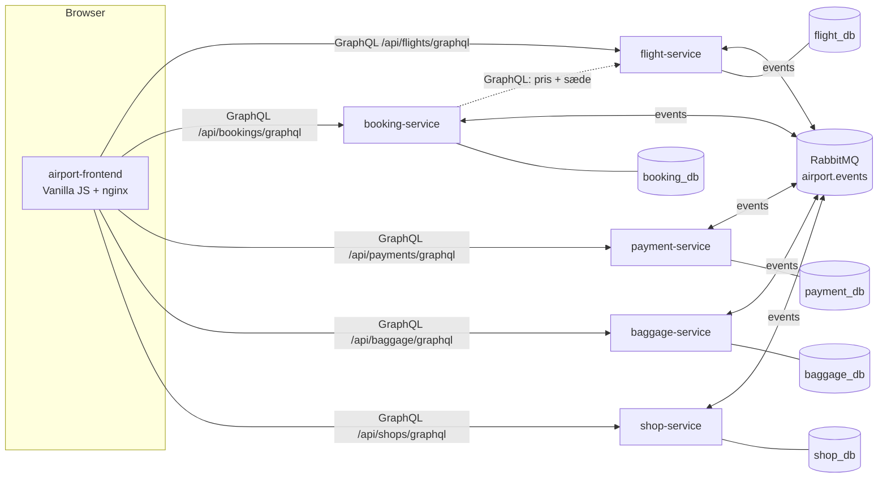
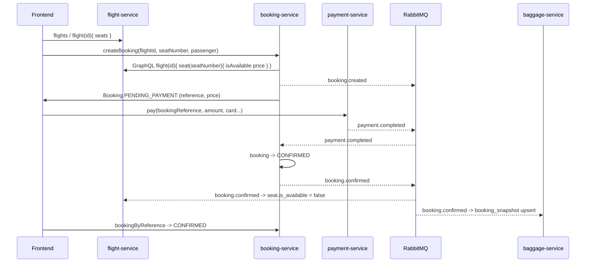
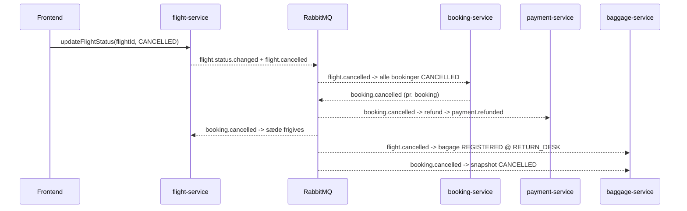

# Arkitektur

## Overblik



```
  [Frontend]  --GraphQL-->  [Flight Service]   ---> flight_db
              --GraphQL-->  [Booking Service]  ---> booking_db   --GraphQL--> Flight Service (pris/sæde)
              --GraphQL-->  [Payment Service]  ---> payment_db
              --GraphQL-->  [Baggage Service]  ---> baggage_db
              --GraphQL-->  [Shop Service]     ---> shop_db

  Alle backend-services <--events--> [RabbitMQ: topic exchange "airport.events"]
```

Regler der overholdes:

* Én PostgreSQL-database pr. service. Ingen service læser i en anden services database.
* Synkront: frontend → service via GraphQL over HTTP (Spring for GraphQL). Kun `/actuator/health` er REST.
* Asynkront: service → service via events på RabbitMQ (se [events.md](events.md)).
* Services cacher snapshots fra events (fx booking gemmer flightnummer, afgangstid, gate og flystatus;
  baggage gemmer `booking_snapshot`). Kilden til sandhed er altid den ejende service.
* Frontend kalder services direkte. I docker-compose via `localhost:808x` med CORS; i Kubernetes via
  én Ingress, hvor frontend og API deler origin.

## Teknologi pr. service

Alle fem backend-services er bygget over samme skabelon (flight-service var den første og de øvrige er
kopier af strukturen):

| Lag         | Pakke        | Indhold                                                                 |
|-------------|--------------|-------------------------------------------------------------------------|
| domain      | `.domain`    | JPA-entiteter, enums, `ApiException` + `ErrorCode`                      |
| repository  | `.repository`| Spring Data JPA repositories (+ Specifications hvor der filtreres)      |
| service     | `.service`   | Forretningslogik, transaktioner, ren domænelogik (pris, regler, Dijkstra) |
| graphql     | `.graphql`   | `@Controller` med `@QueryMapping`/`@MutationMapping`/`@SchemaMapping`, input-records med Bean Validation, `GraphQlExceptionResolver` |
| messaging   | `.messaging` | `EventEnvelope`, `EventPublisher`, consumers + transaktionelle handlers, `ProcessedEvent` (idempotens) |
| config      | `.config`    | RabbitMQ-topologi (exchange, køer, DLQ), GraphQL-scalars                |

Skema og seed-data styres af Flyway (`V1__init.sql`, `V2__seed.sql`); Hibernate kører med `ddl-auto=validate`.

### GraphQL-fejl

Alle fejl returneres i `errors[].extensions.code` med en af koderne
`NOT_FOUND`, `VALIDATION_ERROR`, `INVALID_STATE`, `SEAT_TAKEN`, `UPSTREAM_UNAVAILABLE`, `ALREADY_PAID`,
`BAGGAGE_LIMIT_EXCEEDED`, `ROUTE_NOT_FOUND`, `CONFLICT`, `INTERNAL_ERROR`, `PAYMENT_FAILED`.
`PAYMENT_FAILED` er defineret, men kastes ikke: `pay` returnerer et `Payment` med `status: FAILED` og `failureReason`
i stedet for en GraphQL-fejl (se designvalg nedenfor).
Bean Validation-fejl (`ConstraintViolationException`) mappes til `VALIDATION_ERROR` med feltnavne i beskeden.

### Messaging

* Én topic exchange `airport.events`, routing key = eventnavn.
* Én durable kø pr. service pr. interesse (`<service>.<interesse>-events`), bundet med `<prefix>.#`.
* Retry: Spring AMQP stateless retry, 3 forsøg med eksponentiel backoff; derefter reject → dead-letter
  exchange `airport.events.dlx` → `<service>.dlq`.
* Idempotens: `processed_event(event_id)` skrives i samme transaktion som tilstandsændringen.
* Publicering er bundet til databasetransaktionen: `RabbitTemplate` er channel-transacted, så et event
  først sendes når den omkringliggende `@Transactional` metode committer.
* Consumeren parser selv envelope-JSON (ingen `__TypeId__`-magi), så services kan have hver sin kopi af
  `EventEnvelope` uden delt bibliotek.

## Flows

### Flow A – Booking og betaling



1. Frontend henter afgange og sæder fra flight-service.
2. `createBooking` → booking-service validerer sædet og henter prisen synkront hos flight-service,
   gemmer booking i `PENDING_PAYMENT` og publicerer `booking.created`.
   Dobbeltbooking forhindres af et partielt unikt indeks på `(flight_id, seat_number) WHERE status <> 'CANCELLED'`
   → fejlkode `SEAT_TAKEN`.
3. `pay(...)` → payment-service simulerer gateway og publicerer `payment.completed` (eller `payment.failed`).
4. booking-service modtager `payment.completed` → `CONFIRMED` → publicerer `booking.confirmed`
   (`payment.failed` → `CANCELLED` → `booking.cancelled`).
5. flight-service markerer sædet optaget. 6. baggage-service opretter `booking_snapshot`.
7. Frontend poller `bookingByReference` og viser `CONFIRMED`.

### Flow B – Bagage

1. `registerBaggage(reference, 23, CHECKED)` → baggage-service tjekker `booking_snapshot.status ∈ {CONFIRMED, CHECKED_IN}`,
   max 3 CHECKED pr. booking og max 32 kg → tag `BAG-XXXXXXXX`, event `baggage.registered`.
2. `updateBaggageStatus(tag, LOADED, "Belt 4")` → event `baggage.status.changed`.
3. Frontend viser bagage under "Min booking" (`baggageByBooking`).

### Flow C – Aflysning



### Flow D – Navigation

1. Frontend vælger fra-node ("Security T2") og til-node ("Gate B12") blandt `navNodes`.
2. `route(fromNodeId, toNodeId, accessibleOnly)` → Dijkstra over `nav_edge` (kanterne behandles som
   tovejs; `accessibleOnly=true` udelader kanter med `accessible=false`, fx trapper).
3. Svaret indeholder trin-for-trin instruktioner, samlet afstand, estimeret gangtid (80 m/min) og
   `shopsAlongRoute` – butikker hvis node indgår i ruten. Frontend tegner gangnetværket og ruten på et SVG-kort med
   nummererede trin, instruktionstekst pr. trin, afstand pr. delstrækning og retningspile; trin på en anden etage vises som hint.

## Designvalg (hvor spec'en gav frihed)

| Emne | Valg | Begrundelse |
|------|------|-------------|
| Pris i booking-service | Synkront GraphQL-kald til flight-service (`RestClient`) ved `createBooking` | Enkelt, altid korrekt pris og sædestatus; ingen kopi af sædedata i booking_db |
| Booking-snapshot | `booking` har ekstra kolonner `gate`, `flight_status`, `currency` | `flight.status.changed`/`flight.gate.changed` har noget at opdatere; vises under "Min booking" |
| Passager | Nøgle = e-mail (case-insensitivt unikt indeks); navn/pas opdateres ved ny booking | Enkel identitet uden login |
| Bookingreference | 6 tegn fra `ABCDEFGHJKLMNPQRSTUVWXYZ23456789` (uden 0/O/1/I), op til 5 forsøg ved kollision | Læsbar og entydig |
| Annullering | Tilladt fra PENDING_PAYMENT, CONFIRMED og CHECKED_IN; `payment.failed` giver årsag "Payment failed: <reason>" | Spec forbyder ikke annullering efter check-in |
| Sædepris | `basePrice` på flight × klassemultiplikator (ECONOMY 1.0, BUSINESS 2.5, FIRST 4.0) | Spec'ens seat-tabel har ingen pris; dette holder prisen i flight-service |
| Sædelayout | Rækker á 6 (A–F), række 1–2 BUSINESS | Deterministisk, samme regel i SQL-seed og `SeatGenerator` |
| Fælles event-envelope | Identisk record kopieret ind i hver service | Ingen delt Maven-modul → hver service bygger uafhængigt med én Dockerfile |
| Topic-binding | `<prefix>.#` | `*` matcher kun ét segment; `flight.status.changed` har tre |
| GraphQL-path | Hver service serverer på `/api/<x>/graphql` (`GRAPHQL_PATH`) | Samme path lokalt og bag Ingress → ingen rewrite-regler |
| Fejlet betaling | `pay` returnerer `Payment` med `status: FAILED` og `failureReason` | Frontend kan vise årsagen; booking annulleres asynkront via `payment.failed` |
| Betalingsvalidering | Scalar-argumenterne samles i `PayInput` og valideres med en injiceret `Validator` | Feltnavne i fejlbeskeden; spec'ens signatur `pay(bookingReference, amount, ...)` bevares |
| Udløbsdato | `MM/YY` og `MM/YYYY`; kortet gælder til månedens sidste dag; "Card expired" vinder over "0000" | Enkel, forudsigelig simuleringsregel |
| Payment kender ikke bookingen | payment-service har intet booking-snapshot; `ALREADY_PAID` forhindrer dobbeltbetaling af samme reference | Spec kræver kun lytning på `booking.cancelled`; beløbet kommer fra frontenden (bookingens pris) |
| Bagage-snapshot | `booking_snapshot` har ekstra kolonne `flight_id`; `booking.created` gemmes også (PENDING_PAYMENT) | `flight.cancelled` kan matche på id og nummer; ubetalt booking giver `INVALID_STATE` frem for `NOT_FOUND` |
| Bagage-lokation | Registrering sætter `last_location=CHECK_IN`; aflyst fly → `RETURN_DESK` (bagage der er ARRIVED/LOST springes over) | Spec kræver kun RETURN_DESK; CHECK_IN giver en meningsfuld startværdi |
| Navigationsgraf | `nav_edge` gemmes én gang og behandles som tovejs; `accessibleOnly` udelader `accessible=false` (trapper) | Halvt så mange rækker, samme resultat |
| Ruteinstruktioner | Dansk: "Start ved …", "Gå N m til …", "Tag elevatoren/trappen til etage N", "Du er fremme ved …"; gangtid 80 m/min | Tekstbaseret rute som spec'en kræver |
| Åbningstider | `HH:MM-HH:MM` (også over midnat) eller `24/7`, evalueret i `APP_TIMEZONE` (Europe/Copenhagen) | Enkelt format i seed-data |
| Ekstra query | `navEdges(terminal)` i shop-service | Frontenden tegner gangnetværket (kanterne) på SVG-kortet; kanter med `accessible=false` stiples |
| Postgres | 5 separate containere / StatefulSets | Afspejler Kubernetes-opsætningen og "én database pr. service" |
| pgAdmin i Kubernetes | Dev/demo-værktøj i `k8s/tools/` bag Ingress på `/pgadmin`, uden login (desktop mode); de fem databaser forudregistreret (ConfigMap) med kodeord fra en pgpass-fil (Secret) | Viser "én database pr. service" og eventflowet live i en demo; ikke en del af systemet og fjernes med én linje i `kustomization.yaml` |
| Strukturerede logs | Spring Boots indbyggede `logging.structured.format.console=logstash` i `prod`-profil | Ingen ekstra dependency |
| Ubetalte bookinger | Forbliver `PENDING_PAYMENT` (ingen timeout) | Ikke krævet; kendt begrænsning – sædet er reserveret i booking_db men vises ledigt i flight-service indtil betaling |
