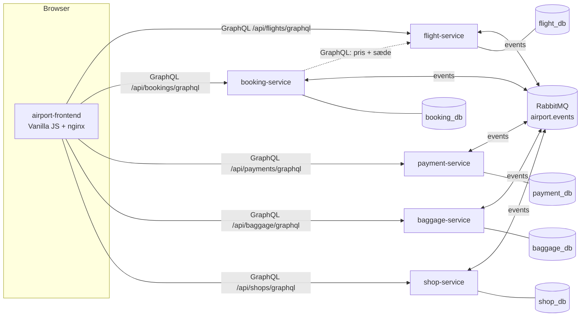
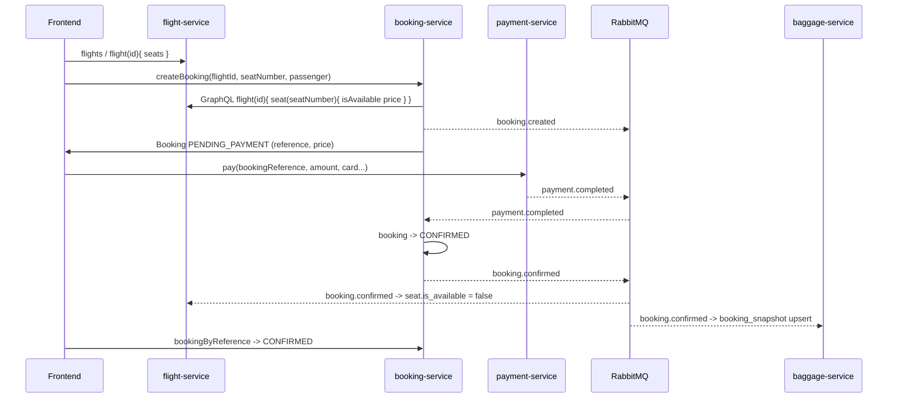
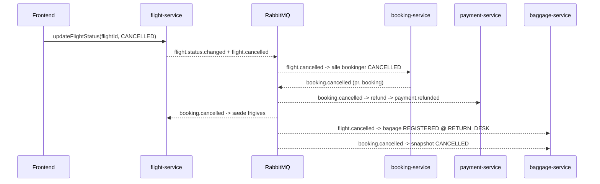

# Arkitektur

## Overblik



```
  [Frontend]  --GraphQL-->  [Flight Service]   ---> flight_db
              --GraphQL-->  [Booking Service]  ---> booking_db   --GraphQL--> Flight Service (pris/sæde)
              --GraphQL-->  [Payment Service]  ---> payment_db
              --GraphQL-->  [Baggage Service]  ---> baggage_db
              --GraphQL-->  [Shop Service]     ---> shop_db

  Alle backend-services <--events--> [RabbitMQ: topic exchange "airport.events"]
```

Regler der overholdes:

* Én PostgreSQL-database pr. service. Ingen service læser i en anden services database.
* Synkront: frontend → service via GraphQL over HTTP (Spring for GraphQL) med Keycloak-JWT som Bearer-token på
  beskyttede operationer (se *Sikkerhed*). Kun actuator-endpoints (`/actuator/health`, `/actuator/info`, `/actuator/metrics`) er REST.
* Asynkront: service → service via events på RabbitMQ (se [events.md](events.md)).
* Services cacher snapshots fra events (fx booking gemmer flightnummer, afgangstid, gate og flystatus;
  baggage gemmer `booking_snapshot`). Kilden til sandhed er altid den ejende service.
* Frontend kalder services direkte. I docker-compose via `localhost:808x` med CORS; i Kubernetes via
  én Ingress, hvor frontend og API deler origin.

## Teknologi pr. service

Alle fem backend-services er bygget over samme skabelon (flight-service var den første og de øvrige er
kopier af strukturen):

| Lag         | Pakke        | Indhold                                                                 |
|-------------|--------------|-------------------------------------------------------------------------|
| domain      | `.domain`    | JPA-entiteter, enums, `ApiException` + `ErrorCode`                      |
| repository  | `.repository`| Spring Data JPA repositories (+ Specifications hvor der filtreres)      |
| service     | `.service`   | Forretningslogik, transaktioner, ren domænelogik (pris, regler, Dijkstra) |
| graphql     | `.graphql`   | `@Controller` med `@QueryMapping`/`@MutationMapping`/`@SchemaMapping`, input-records med Bean Validation, `GraphQlExceptionResolver` |
| messaging   | `.messaging` | `EventEnvelope`, `EventPublisher` + `OutboxEvent`/`OutboxRelay` (transactional outbox), consumers + transaktionelle handlers, `ProcessedEvent` (idempotens) |
| config      | `.config`    | RabbitMQ-topologi (exchange, køer, DLQ), GraphQL-scalars                |

Skema og seed-data styres af Flyway (`V1__init.sql`, `V2__seed.sql`, `V{n}__outbox.sql`); Hibernate kører med
`ddl-auto=validate`.

### GraphQL-fejl

Alle fejl returneres i `errors[].extensions.code` med en af koderne
`NOT_FOUND`, `VALIDATION_ERROR`, `INVALID_STATE`, `SEAT_TAKEN`, `UPSTREAM_UNAVAILABLE`, `ALREADY_PAID`,
`BAGGAGE_LIMIT_EXCEEDED`, `ROUTE_NOT_FOUND`, `CONFLICT`, `INTERNAL_ERROR`, `PAYMENT_FAILED`,
`UNAUTHORIZED` (operationen kræver login, men der var intet gyldigt Bearer-token) og `FORBIDDEN` (logget ind, men
rollen tillader ikke operationen – fx `PASSENGER` der kalder `updateFlightStatus`). Et token, der er udløbet eller
har forkert `iss`, afvises med HTTP 401 allerede inden GraphQL.
`PAYMENT_FAILED` er defineret, men kastes ikke: `pay` returnerer et `Payment` med `status: FAILED` og `failureReason`
i stedet for en GraphQL-fejl (se designvalg nedenfor).
Bean Validation-fejl (`ConstraintViolationException`) mappes til `VALIDATION_ERROR` med feltnavne i beskeden.

### Messaging

* Én topic exchange `airport.events`, routing key = eventnavn.
* Én durable kø pr. service pr. interesse (`<service>.<interesse>-events`), bundet med `<prefix>.#`.
* Retry: Spring AMQP stateless retry, 3 forsøg med eksponentiel backoff; derefter reject → dead-letter
  exchange `airport.events.dlx` → `<service>.dlq`.
* Idempotens: `processed_event(event_id)` skrives i samme transaktion som tilstandsændringen.
* Publicering går gennem en **transactional outbox**: `EventPublisher.publish` rører ikke RabbitMQ, men
  serialiserer envelopen og indsætter den i tabellen `outbox_event` i samme transaktion som
  tilstandsændringen. Tilstand og event committes derfor atomisk (eller rulles tilbage sammen), og
  `publish` fejler hårdt hvis den kaldes uden for en transaktion.
* `OutboxRelay` (`@Scheduled`, hvert 500 ms) sender rækkerne videre: den tager en Postgres advisory lock
  (`pg_try_advisory_xact_lock`), så kun ét relay er aktivt pr. service selv med flere replicas, læser de ældste
  usendte rækker (`ORDER BY id ... FOR UPDATE`), sender batchen med publisher confirms
  (`RabbitTemplate.invoke` + `waitForConfirmsOrDie`) og sætter først `published_at` når brokeren har
  bekræftet. Fejler sendingen (broker nede, nack, timeout) tælles `attempts` op, `last_error` gemmes, og
  rækkerne bliver liggende til næste poll. Backloggen ses som gauge `outbox.pending` (`/actuator/metrics`).
* Garanti: at-least-once fra producent + idempotent consumer (`processed_event`) = effektivt exactly-once.
  Dør relayet mellem bekræftelse og commit, sendes rækken igen med samme `eventId`, og modtageren
  ignorerer duplikatet. Rækkefølgen pr. producent bevares (ét aktivt relay, `ORDER BY id`, en fejlet batch
  gentages som helhed).
* Consumeren parser selv envelope-JSON (ingen `__TypeId__`-magi), så services kan have hver sin kopi af
  `EventEnvelope` uden delt bibliotek.

## Flows

### Flow A – Booking og betaling



1. Frontend henter afgange og sæder fra flight-service.
2. `createBooking` → booking-service validerer sædet og henter prisen synkront hos flight-service,
   gemmer booking i `PENDING_PAYMENT` og publicerer `booking.created`.
   Dobbeltbooking forhindres af et partielt unikt indeks på `(flight_id, seat_number) WHERE status <> 'CANCELLED'`
   → fejlkode `SEAT_TAKEN`.
3. `pay(...)` → payment-service simulerer gateway og publicerer `payment.completed` (eller `payment.failed`).
4. booking-service modtager `payment.completed` → `CONFIRMED` → publicerer `booking.confirmed`
   (`payment.failed` → `CANCELLED` → `booking.cancelled`).
5. flight-service markerer sædet optaget. 6. baggage-service opretter `booking_snapshot`.
7. Frontend poller `bookingByReference` og viser `CONFIRMED`.

### Flow B – Bagage

1. `registerBaggage(reference, 23, CHECKED)` → baggage-service tjekker `booking_snapshot.status ∈ {CONFIRMED, CHECKED_IN}`,
   max 3 CHECKED pr. booking og max 32 kg → tag `BAG-XXXXXXXX`, event `baggage.registered`.
2. `updateBaggageStatus(tag, LOADED, "Belt 4")` → event `baggage.status.changed`.
3. Frontend viser bagage under "Min booking" (`baggageByBooking`).

### Flow C – Aflysning



### Flow D – Navigation

1. Frontend vælger fra-node ("Security T2") og til-node ("Gate B12") blandt `navNodes`.
2. `route(fromNodeId, toNodeId, accessibleOnly)` → Dijkstra over `nav_edge` (kanterne behandles som
   tovejs; `accessibleOnly=true` udelader kanter med `accessible=false`, fx trapper).
3. Svaret indeholder trin-for-trin instruktioner, samlet afstand, estimeret gangtid (80 m/min) og
   `shopsAlongRoute` – butikker hvis node indgår i ruten. Frontend tegner gangnetværket og ruten på et SVG-kort med
   nummererede trin, instruktionstekst pr. trin, afstand pr. delstrækning og retningspile; trin på en anden etage vises som hint.

## Sikkerhed (login og roller)

Login og roller er lagt oven på systemet uden at ændre GraphQL-API'et: Keycloak er OpenID Connect-provider,
frontenden er OIDC-client, og de fem services er OAuth2 resource servers, der alene validerer et Bearer-token.
Læsning (afgange, butikker, opslag af booking) kræver stadig ikke login.

### Komponenter

* **Keycloak 26** (`quay.io/keycloak/keycloak:26.7.3`, `start-dev --import-realm`, H2 i en `emptyDir`/container).
  Realm'et `airport` importeres ved hver opstart fra `k8s/keycloak/realm-airport.json` – samme fil i docker-compose
  (mount) og Kubernetes (ConfigMap `keycloak-realm` via `configMapGenerator`). Realm'et definerer realm-rollerne
  `PASSENGER` og `OPERATIONS`, testbrugerne `anna`/`anna` (PASSENGER, `anna@example.com`) og `ops`/`ops`
  (OPERATIONS, `ops@example.com`) og den public client `airport-frontend`: Authorization Code + PKCE (S256), ingen
  client secret, redirect-URIs for `localhost:8080` (compose), `localhost:8090` (kind) og `airport.local`. Direct access
  grants er slået til, så `scripts/e2e-smoke.sh` og `curl` kan hente tokens med password grant. Access tokens lever
  5 minutter (`accessTokenLifespan: 300`) og signeres med RS256.
* **Frontend som OIDC-client** (`frontend/js/auth.js`): én instans af den vendorede `keycloak-js` 26.2.4
  (`js/vendor/keycloak.js` – Keycloak 26 serverer ikke længere adapteren selv, og npm-pakken er ES-module only).
  `initAuth()` kører før første render med `onLoad: 'check-sso'` og `silent-check-sso.html` i en skjult iframe, så en
  eksisterende session overlever en page refresh uden redirect; `pkceMethod: 'S256'`, `responseMode: 'query'` (så
  `#/route` overlever turen til Keycloak) og `checkLoginIframe: false` (kræver tredjeparts-cookies; token-refresh
  dækker i stedet). Siderne *Book*, *Betaling* og *Bagage* sender brugeren til login før render (`LOGIN_REQUIRED` i
  `app.js`); operations-panelet under *Afgange* vises kun med `hasRole('OPERATIONS')`. `frontend/js/api.js` kalder
  `getToken()` før hvert GraphQL-kald (refresh når tokenet udløber inden 30 s) og sætter
  `Authorization: Bearer <token>`, når brugeren er logget ind. Keycloaks adresse kommer fra `js/config.js`:
  `http://localhost:8180` i compose og `<origin>/auth` i Kubernetes (ConfigMap over `config.js`).
* **Services som OAuth2 resource servers** – `config/SecurityConfig.java` og `config/KeycloakRoleConverter.java`
  er identiske i alle fem services. Kæden er stateless (`SessionCreationPolicy.STATELESS`, CSRF slået fra, ingen
  cookies); `oauth2ResourceServer().jwt()` validerer tokenet, og `KeycloakRoleConverter` oversætter
  `realm_access.roles` til `ROLE_<navn>` (client-roller i `resource_access` ignoreres – realm'et bruger kun
  realm-roller). `Authentication.getName()` er `preferred_username`. På HTTP-niveau er GraphQL-endpointet,
  `/actuator/health/**`, `/actuator/info` og `/graphiql` (kun dev-profil) åbne; alle andre URL'er (fx
  `/actuator/metrics`) kræver OPERATIONS. Selve autorisationen ligger pr. operation som `@PreAuthorize` på
  controller-metoderne (`@EnableMethodSecurity`). CORS ligger i samme filterkæde (`CORS_ALLOWED_ORIGINS`), og fordi
  `CorsFilter` kører før autentificering, kræver preflight-requests aldrig et token.

### Login- og kaldsflow

```mermaid
sequenceDiagram
  participant B as Browser (frontend + keycloak-js)
  participant KC as Keycloak (realm airport)
  participant S as service (resource server)

  B->>KC: GET /protocol/openid-connect/auth (client_id=airport-frontend, code_challenge S256)
  KC-->>B: login-side; brugeren logger ind (anna/anna)
  KC-->>B: redirect tilbage til frontenden med ?code=...
  B->>KC: POST /protocol/openid-connect/token (code + code_verifier)
  KC-->>B: access token (JWT: iss, exp, preferred_username, email, realm_access.roles)
  B->>S: POST /api/.../graphql, Authorization: Bearer JWT
  S->>KC: GET JWK_SET_URI (intern adresse) - første gang, derefter cachet
  KC-->>S: signeringsnøgler (JWKS)
  S->>S: signatur, exp og iss == OIDC_ISSUER_URI
  alt token ugyldigt (udløbet, forkert iss, ikke et JWT)
    S-->>B: HTTP 401, WWW-Authenticate: Bearer error="invalid_token"
  else token ok (eller slet intet token)
    S->>S: @PreAuthorize på operationen (ROLE_PASSENGER / ROLE_OPERATIONS)
    alt intet token på beskyttet operation
      S-->>B: HTTP 200, errors[].extensions.code = UNAUTHORIZED
    else forkert rolle
      S-->>B: HTTP 200, errors[].extensions.code = FORBIDDEN
    else tilladt
      S-->>B: HTTP 200, data
    end
  end
```

Nøglerne hentes første gang et token skal valideres og caches derefter i servicen (Nimbus henter igen, hvis et token
peger på et ukendt `kid`). Et request uden `Authorization`-header er anonymt: offentlige queries svarer som før,
beskyttede operationer giver `UNAUTHORIZED`.

### Operation × rolle

`@PreAuthorize` sidder på controller-metoderne (`graphql/<X>Controller.java`); `@SchemaMapping`-felter (fx
`Flight.seats`, `Passenger.bookings`) følger den query, de hentes igennem, og har ingen egen regel.

| Service         | Operation                                                                        | Type     | Hvem må kalde                                    |
|-----------------|----------------------------------------------------------------------------------|----------|--------------------------------------------------|
| flight-service  | `airlines`, `airline`, `flights`, `flight`, `flightByNumber`, `availableSeats`   | query    | Alle                                             |
| flight-service  | `createAirline`, `createAircraft`, `createFlight`, `updateFlightStatus`, `updateGate` | mutation | OPERATIONS                                  |
| booking-service | `booking`, `bookingByReference`, `passenger`                                     | query    | Alle                                             |
| booking-service | `bookingsByPassenger(email)`                                                     | query    | PASSENGER (kun egen e-mail) / OPERATIONS (alle)  |
| booking-service | `createBooking`, `cancelBooking`, `checkIn`                                      | mutation | PASSENGER / OPERATIONS                           |
| payment-service | `payment`                                                                        | query    | Alle                                             |
| payment-service | `paymentsByBooking`                                                              | query    | PASSENGER / OPERATIONS                           |
| payment-service | `pay`                                                                            | mutation | PASSENGER / OPERATIONS                           |
| payment-service | `refund`                                                                         | mutation | OPERATIONS                                       |
| baggage-service | `baggage`, `baggageByFlight`, `bookingSnapshot`                                  | query    | Alle                                             |
| baggage-service | `baggageByBooking`                                                               | query    | PASSENGER / OPERATIONS                           |
| baggage-service | `registerBaggage`                                                                | mutation | PASSENGER / OPERATIONS                           |
| baggage-service | `updateBaggageStatus`                                                            | mutation | OPERATIONS                                       |
| shop-service    | `shops`, `shop`, `searchShops`, `navNodes`, `navEdges`, `route`                  | query    | Alle                                             |
| shop-service    | `createShop`, `updateShop`, `deleteShop`                                         | mutation | OPERATIONS                                       |

Særregel: `bookingsByPassenger` beholder sit `email`-argument (det er en del af API'et), men tokenet afgør, hvad
det må være – en PASSENGER må kun angive sin egen e-mail (`email`-claim, case-insensitivt), ellers `FORBIDDEN`;
OPERATIONS må slå alle op. Uden for GraphQL: `/actuator/health`, `/actuator/health/**`, `/actuator/info` og
GraphiQL (`/graphiql`, kun dev-profil) er offentlige; øvrige actuator-endpoints (`/actuator/metrics`) kræver
OPERATIONS.

### Konfiguration: issuer og JWKS

Hver service får to værdier (`application.yml` → `spring.security.oauth2.resourceserver.jwt`):

| Env-var           | Betydning                                                                                           |
|-------------------|-----------------------------------------------------------------------------------------------------|
| `OIDC_ISSUER_URI` | Den streng, tokenets `iss` skal være lig med: Keycloaks *browser-vendte* URL + `/realms/airport`. Keycloak låser den med `KC_HOSTNAME`, så alle tokens har samme `iss`, uanset om de er hentet fra browseren eller inde fra netværket |
| `JWK_SET_URI`     | Hvor servicen henter signeringsnøglerne: Keycloaks *interne* adresse i compose-netværket/clusteret  |

| Miljø          | `OIDC_ISSUER_URI`                            | `JWK_SET_URI`                                                             |
|----------------|----------------------------------------------|---------------------------------------------------------------------------|
| docker-compose | `http://localhost:8180/realms/airport`       | `http://keycloak:8080/realms/airport/protocol/openid-connect/certs`       |
| kind           | `http://localhost:8090/auth/realms/airport`  | `http://keycloak:8080/auth/realms/airport/protocol/openid-connect/certs`  |

Når både `issuer-uri` og `jwk-set-uri` er sat, bruger Spring **aldrig** OIDC discovery
(`/.well-known/openid-configuration`): den henter nøglerne fra `jwk-set-uri` og sammenligner `iss` med
`issuer-uri` som ren streng. Derfor behøver en service aldrig at kunne nå `localhost:8180`/`localhost:8090`, og
browseren behøver ikke at kunne nå `keycloak:8080`. Faldgruben er, at Keycloak som udgangspunkt udleder `iss` af
den URL, forespørgslen kom ind på, så tokens hentet fra browseren og fra en container ville få to forskellige
issuers, og kun den ene ville blive accepteret. Løsningen er `KC_HOSTNAME` (compose: `http://localhost:8180`,
kind: `http://localhost:8090/auth`), som låser alle URL'er Keycloak udgiver. Skifter man host eller port (fx
minikube), skal `KC_HOSTNAME`, `OIDC_ISSUER_URI` i `k8s/base/services/*.yaml` og `KEYCLOAK_URL` i frontendens ConfigMap
rettes sammen; symptomet ellers er HTTP 401 med `WWW-Authenticate: ... invalid_token ... The iss claim is not valid`.
Detaljer, verifikation og hvorfor `KC_PROXY_HEADERS`/`KC_HOSTNAME_BACKCHANNEL_DYNAMIC` bevidst er slået fra: se
[k8s/README.md, Keycloak (login)](../k8s/README.md#keycloak-login).

### GitHub-login (identity brokering)

Realm'et definerer en identity provider `github` (`providerId: github`), som er **slået fra** og har placeholder
client id/secret i `realm-airport.json`. En mapper (`github-users-are-passengers`, `oidc-hardcoded-role-idp-mapper`)
giver alle brokerede brugere rollen PASSENGER; e-mailen hentes med scope `user:email` og regnes som verificeret
(`trustEmail: true`). Sådan tændes den:

1. Opret en OAuth App på GitHub: *Settings → Developer settings → OAuth Apps → New OAuth App*.
   *Homepage URL* = frontendens URL (fx `http://localhost:8080`); *Authorization callback URL* =
   `<KEYCLOAK_URL>/realms/airport/broker/github/endpoint`, dvs.
   `http://localhost:8180/realms/airport/broker/github/endpoint` i compose eller
   `http://localhost:8090/auth/realms/airport/broker/github/endpoint` i kind. Gem Client ID og generér en Client secret.
2. Åbn Keycloaks admin console (`admin`/`admin`; compose `http://localhost:8180/admin/`, kind
   `http://localhost:8090/auth/admin/`) → realm `airport` → *Identity providers* → *GitHub* → indsæt Client ID og
   Client Secret → *Enabled* = on → *Save*.
3. Login-siden viser nu en *GitHub*-knap ved siden af brugernavn/kode. Første login opretter brugeren i realm'et med
   rollen PASSENGER (`syncMode: IMPORT`).

Bemærk: Keycloak kører med H2-databasen i dev-mode, og realm'et importeres forfra ved hver genstart. Indstillingen
(og de brugere GitHub-login har oprettet) forsvinder derfor ved genstart, medmindre client id/secret også skrives
ind i `realm-airport.json` (`identityProviders[0].config` og `enabled: true`) – hvilket ikke bør committes.

### Fejl og frontendens reaktion

| Svar                                              | Hvornår                                                                                             | Frontend (`api.js`)                                                 |
|---------------------------------------------------|-----------------------------------------------------------------------------------------------------|---------------------------------------------------------------------|
| GraphQL-fejl `UNAUTHORIZED` (HTTP 200)            | Beskyttet operation uden gyldigt Bearer-token (anonymt kald rammer `@PreAuthorize`)                 | `login()`: til Keycloak og tilbage til samme route; brugeren gentager handlingen; besked "Log ind for at fortsætte" |
| GraphQL-fejl `FORBIDDEN` (HTTP 200)               | Logget ind, men forkert rolle (fx PASSENGER → `updateFlightStatus`), eller `bookingsByPassenger` med en anden e-mail | Dansk besked "<bruger> har ikke rettighed til denne handling"; ingen redirect |
| HTTP 401, `WWW-Authenticate: Bearer error="invalid_token"` | Tokenet afvises af Spring Security før GraphQL: udløbet, forkert `iss`, ugyldig signatur eller ikke et JWT | `login()` + "Din session er udløbet - log ind igen"           |
| HTTP 401 / 403 uden GraphQL-body                  | Andre URL'er end de offentlige (fx `/actuator/metrics`) uden token / uden OPERATIONS                | Kaldes ikke fra frontenden                                          |

`GraphQlExceptionResolver` afgør mellem de to GraphQL-koder ved at se på `SecurityContext`: en `AccessDeniedException`
fra `@PreAuthorize` bliver `UNAUTHORIZED`, hvis kalderen er anonym, ellers `FORBIDDEN` (se også *GraphQL-fejl*).
Udløbne tokens ses sjældent fra frontenden, fordi `getToken()` fornyer tokenet, når det udløber inden 30 s.

### Designvalg og test

| Nr. | Valg                                                                                          | Alternativ overvejet                                                     | Begrundelse |
|-----|-----------------------------------------------------------------------------------------------|--------------------------------------------------------------------------|-------------|
| 1   | Keycloak 26 med realm-import (`realm-airport.json`) og faste testbrugere `anna`/`ops`         | Egen bruger-/kodeordstabel i en service; hosted IdP (Auth0, Entra ID)   | Standard OIDC uden egen kodeordshåndtering; realm-filen er én kilde til roller, client og brugere for compose og k8s og giver kendt tilstand ved hver demo; en hosted IdP kræver netadgang og konti, som eksamen ikke kan forudsætte |
| 2   | Læse-queries offentlige; autorisation pr. operation med `@PreAuthorize` på controller-metoderne | URL-baserede regler i `SecurityFilterChain`; en API-gateway foran services | Én GraphQL-endpoint pr. service bærer både offentlige queries og beskyttede mutations, så URL-regler kan ikke skelne; method security holder reglen ved siden af operationen og giver GraphQL-koder i stedet for HTTP-fejl; en gateway ville være endnu en komponent uden at fjerne behovet for rolletjek i servicen |
| 3   | `iss` låst med `KC_HOSTNAME`, nøgler fra intern `JWK_SET_URI`, ingen discovery; proxy-headers og dynamisk backchannel bevidst slået fra | Discovery via `issuer-uri` alene; `KC_HOSTNAME_BACKCHANNEL_DYNAMIC`/`KC_PROXY_HEADERS` | Discovery kræver, at servicen kan nå browserens Keycloak-URL, hvilket den ikke kan fra compose-netværket/clusteret; med to eksplicitte værdier er begge sider uafhængige, og alle tokens får samme `iss`. Proxy-headers lækker ingress-nginx' `X-Forwarded-Port: 80` ind i discovery-dokumentet (verificeret 15-09-2026) |

Test: hver service har en `TestTokens`-klasse (test scope, `@TestConfiguration`), der genererer en RSA-nøgle ved
opstart, minter RS256-JWT'er med samme claims som Keycloak (`iss`, `preferred_username`, `email`,
`realm_access.roles`) og erstatter `JwtDecoder` med en, der stoler på testnøglen og kræver samme `iss` som
`application.yml`. Alt andet – Bearer-header, issuer-tjek, rolle-mapping, `@PreAuthorize`, CORS – kører præcis som i
drift, så integrationstestene går gennem den rigtige HTTP-filterkæde uden en kørende Keycloak.
`SecurityIntegrationTest` i hver service dækker: offentlige queries og readiness uden token, beskyttede operationer
uden token → `UNAUTHORIZED`, forkert rolle → `FORBIDDEN` (booking: også `bookingsByPassenger` med en fremmed e-mail),
rigtig rolle går igennem, udløbet/fremmed/ugyldigt token → HTTP 401 med `invalid_token`, andre actuator-endpoints
kræver OPERATIONS, og CORS-preflight fra frontendens origin tillades. De øvrige integrationstests sender
mutations med `TestTokens.passenger()`/`operations()`.

## Designvalg (hvor spec'en gav frihed)

| Emne | Valg | Begrundelse |
|------|------|-------------|
| Pris i booking-service | Synkront GraphQL-kald til flight-service (`RestClient`) ved `createBooking` | Enkelt, altid korrekt pris og sædestatus; ingen kopi af sædedata i booking_db |
| Booking-snapshot | `booking` har ekstra kolonner `gate`, `flight_status`, `currency` | `flight.status.changed`/`flight.gate.changed` har noget at opdatere; vises under "Min booking" |
| Passager | Nøgle = e-mail (case-insensitivt unikt indeks); navn/pas opdateres ved ny booking. Login-identiteten er Keycloak-brugeren; frontenden forudfylder e-mailen fra tokenet, og `bookingsByPassenger` må kun bruges med tokenets e-mail | Passageren i booking_db er stadig et rent data-objekt (ingen kodeord); koblingen til login går via e-mailen i tokenet |
| Bookingreference | 6 tegn fra `ABCDEFGHJKLMNPQRSTUVWXYZ23456789` (uden 0/O/1/I), op til 5 forsøg ved kollision | Læsbar og entydig |
| Annullering | Tilladt fra PENDING_PAYMENT, CONFIRMED og CHECKED_IN; `payment.failed` giver årsag "Payment failed: <reason>" | Spec forbyder ikke annullering efter check-in |
| Sædepris | `basePrice` på flight × klassemultiplikator (ECONOMY 1.0, BUSINESS 2.5, FIRST 4.0) | Spec'ens seat-tabel har ingen pris; dette holder prisen i flight-service |
| Sædelayout | Rækker á 6 (A–F), række 1–2 BUSINESS | Deterministisk, samme regel i SQL-seed og `SeatGenerator` |
| Fælles event-envelope | Identisk record kopieret ind i hver service | Ingen delt Maven-modul → hver service bygger uafhængigt med én Dockerfile |
| Event-publicering | Transactional outbox (`outbox_event`) med polling relay, publisher confirms og advisory lock | Dual-write-problemet: en channel-transacted `RabbitTemplate` sender beskeden i en separat AMQP-transaktion, der committes *efter* DB-commit, så et event kan gå tabt imellem de to (broker-genstart, tabt forbindelse, pod dræbt) – og i consumer-handlers maskeres tabet af `processed_event`, fordi det indgående event er registreret som behandlet. Med outboxen er DB-commit den eneste sandhed; relayet leverer at-least-once, og `processed_event` fjerner duplikater |
| Topic-binding | `<prefix>.#` | `*` matcher kun ét segment; `flight.status.changed` har tre |
| GraphQL-path | Hver service serverer på `/api/<x>/graphql` (`GRAPHQL_PATH`) | Samme path lokalt og bag Ingress → ingen rewrite-regler |
| Fejlet betaling | `pay` returnerer `Payment` med `status: FAILED` og `failureReason` | Frontend kan vise årsagen; booking annulleres asynkront via `payment.failed` |
| Betalingsvalidering | Scalar-argumenterne samles i `PayInput` og valideres med en injiceret `Validator` | Feltnavne i fejlbeskeden; spec'ens signatur `pay(bookingReference, amount, ...)` bevares |
| Udløbsdato | `MM/YY` og `MM/YYYY`; kortet gælder til månedens sidste dag; "Card expired" vinder over "0000" | Enkel, forudsigelig simuleringsregel |
| Payment kender ikke bookingen | payment-service har intet booking-snapshot; `ALREADY_PAID` forhindrer dobbeltbetaling af samme reference | Spec kræver kun lytning på `booking.cancelled`; beløbet kommer fra frontenden (bookingens pris) |
| Bagage-snapshot | `booking_snapshot` har ekstra kolonne `flight_id`; `booking.created` gemmes også (PENDING_PAYMENT) | `flight.cancelled` kan matche på id og nummer; ubetalt booking giver `INVALID_STATE` frem for `NOT_FOUND` |
| Bagage-lokation | Registrering sætter `last_location=CHECK_IN`; aflyst fly → `RETURN_DESK` (bagage der er ARRIVED/LOST springes over) | Spec kræver kun RETURN_DESK; CHECK_IN giver en meningsfuld startværdi |
| Navigationsgraf | `nav_edge` gemmes én gang og behandles som tovejs; `accessibleOnly` udelader `accessible=false` (trapper) | Halvt så mange rækker, samme resultat |
| Ruteinstruktioner | Dansk: "Start ved …", "Gå N m til …", "Tag elevatoren/trappen til etage N", "Du er fremme ved …"; gangtid 80 m/min | Tekstbaseret rute som spec'en kræver |
| Åbningstider | `HH:MM-HH:MM` (også over midnat) eller `24/7`, evalueret i `APP_TIMEZONE` (Europe/Copenhagen) | Enkelt format i seed-data |
| Ekstra query | `navEdges(terminal)` i shop-service | Frontenden tegner gangnetværket (kanterne) på SVG-kortet; kanter med `accessible=false` stiples |
| Postgres | 5 separate containere / StatefulSets | Afspejler Kubernetes-opsætningen og "én database pr. service" |
| pgAdmin i Kubernetes | Dev/demo-værktøj i `k8s/tools/` bag Ingress på `/pgadmin`, uden login (desktop mode); de fem databaser forudregistreret (ConfigMap) med kodeord fra en pgpass-fil (Secret) | Viser "én database pr. service" og eventflowet live i en demo; ikke en del af systemet og fjernes med én linje i `kustomization.yaml` |
| Strukturerede logs | Spring Boots indbyggede `logging.structured.format.console=logstash` i `prod`-profil | Ingen ekstra dependency |
| Ubetalte bookinger | Forbliver `PENDING_PAYMENT` (ingen timeout) | Ikke krævet; kendt begrænsning – sædet er reserveret i booking_db men vises ledigt i flight-service indtil betaling |
| Login | Keycloak 26 med realm-import (`realm-airport.json`) og faste testbrugere `anna`/`ops` | Se *Sikkerhed (login og roller)*, designvalg 1 |
| Autorisation | Læse-queries offentlige; `@PreAuthorize` pr. operation på controller-metoderne (én GraphQL-endpoint) | Se *Sikkerhed (login og roller)*, designvalg 2 |
| Token-validering | `iss` låst med `KC_HOSTNAME`, nøgler fra intern `JWK_SET_URI`, ingen discovery | Se *Sikkerhed (login og roller)*, designvalg 3 |
